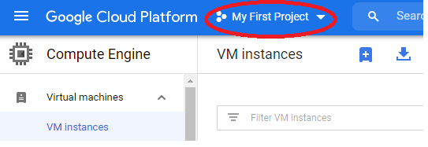
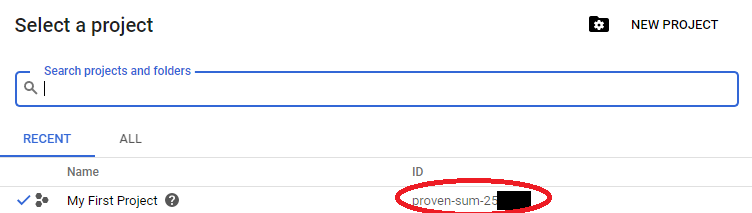

= Frequently asked questions

== Are my Google ID and Google Cloud Project the same? 

NO. 

== What is my Google ID? 
Your Google ID is your gmail ID, before the @ sign. It is also your username on the Google Cloud Shell.

== What is my Google Cloud Project? 

The Google Cloud Project is a unique string of words and numbers that you can find in the Google console top left. Typically the menu item defaults to "My First Project":

Under that menu you'll see the ID(s): 

(Your ID will NOT start with "proven-sum-", it will be some other random string of words and numbers. You can copy it from the menu here. You'll use it in many places throughout your work with Google.)

== Nothing works like I expect (have you lost track of where you are?). 

One big cause of frustration is losing track of where you are. Stop for a minute: are you in the Google Cloud Shell? Or an actual virtual machine you have created? The Google Cloud Shell has, for example, git installed. A lightweight VM probably will not. 

== I pasted in a command and it doesn't work

Often, this is the result of not correctly substituting a value. 

A tutorial may have a step like: 

_Enter the following command_

`$ mkdir <my account>`

If you paste that in literally, you will get something like this: 

`-bash: syntax error near unexpected token `newline'`

This is because 

. You pasted in the `$`, which is there to just show you that you are operating at a command line
. You pasted in, literally, `<my account>`, rather than replacing the `<my account>` with YOUR ACTUAL EMAIL ACCOUNT. In this case, you would NOT include the @stthomas.edu or @gmail.com; however, this may vary. 

This applies in many cases, such as 

[source,bash]
----
$ git clone <my repo path>    # substitute the ACTUAL GITHUB PATH
$ curl <Kubernetes node IP:port>   # substitute the ACTUAL NODE IP ADDRESS, followed by ":", followed by the port.
----
and so forth. 

Some tutorials may not use <>; there is no standard. 

== Offending ECDSA key
If you get an `offending ECDSA key` error, use the suggested removal command.

== Permission denied (publickey)

If you get the error `Permission denied (publickey).`, this probably means that your ssh-agent no longer has the node-user private key added. This easily happens if the Google Cloud Shell goes to sleep and wipes out your session. Check via issuing `ssh-add -l`.

If you get a message to the effect that your agent is not running, type `eval `ssh-agent`` and then `ssh-add ~/.ssh/node-user`.

You should see something like `Identity added: /home/user/.ssh/node-user (node-user)`.

You should now be able to ssh, scp, or rsh. 

== Terraform error refreshing state

If you get 

[source,bash]
----
Error refreshing state: state snapshot was created by Terraform v0.12.8, which is newer than current v0.12.2; upgrade to Terraform v0.12.8 or greater to work with this state
----

execute 

[source,bash]
----
rm -rf terraform.tfstate
terraform init
----

== Nano garbled

If text is overlapping in nano, hit ctrl-L to redraw. 

I had partial success including 

export TERM=screen

in my .bashrc file, but that only seems to work if I only use page up/down. Scrolling with the arrow key is still a problem. 

Issue: https://github.com/vercel/hyper/issues/3391

== Insufficient Permission in Google Cloud Shell

If you receive an `Insufficient Permission` error in the Google Cloud Shell, you may need to reauthenticate. Type `gcloud auth login` and follow the resulting steps.

== Project property set to the empty string

If you get:
[source,bash]
----
 The project property is set to the empty string, which is invalid. To set your project, run: $ gcloud config set project PROJECT_ID or to unset it, run: $ gcloud config unset 

----

Follow the suggested command. Your project name is visible in the Google Cloud Shell, top right usually under "My First Project." When you find it, issue the command

[source,bash]
----
gcloud config set project <MY PROJECT NAME>
Updated property [core/project].prkjnghn@cloudshell:~ 
----

Obviously, you change <MY PROJECT NAME> to your actual project (and leave out the <>).

== API not enabled

If you receive

[source,bash]
----
API [compute.googleapis.com] not enabled on project [389601984173].Would you like to enable and retry (this will take a few minutes)?(y/N)?  
----

Hit `y`, you should get:

`Enabling service [compute.googleapis.com] on project [389601984173]...`

== Address already in use

When starting up the nodejs server with `nodejs server.js &` you may encounter a `address already in use` error. Read carefully, as this output may be further down in the error output. This indicates that there is already a node server running. If you would like to start over, run `ps -ef` to list processes and then kill the correct process by id: `kill {process id}`

== Port already allocated (not to be confused with address already in use)
If on a `docker run` you get 

[source,bash]
----
betz4871:node-svc$ docker run -d -p 8081:30100 dmacademy/node-svc
8d25efd0b098984d5bf16038f609a5fc54861beb36345ad67ea011feb991c397
docker: Error response from daemon: driver failed programming external connectivity on endpoint wizardly_shamir (c730f2ed00186404cef02d6e9d97d2f14f4d4328e5102393f3cff1f2d9ffaca8): Bind for 0.0.0.0:8081 failed: port is already allocated.
----

This means you already have a docker container running and attached to that port. 

run `docker ps` and `docker kill` the image name that is already attached to that port.

[source,bash]
----
betz4871:node-svc$ docker ps
CONTAINER ID        IMAGE                COMMAND                  CREATED             STATUS              PORTS                    NAMES
1571e18f6fb9        dmacademy/node-svc   "docker-entrypoint.s…"   3 minutes ago       Up 3 minutes        0.0.0.0:8081->3000/tcp   cool_ardinghelli
betz4871:node-svc$ docker kill cool_ardinghelli
cool_ardinghelli
----

== Switching Github remote from http (cleartext password) to ssh
See https://docs.github.com/en/github/using-git/changing-a-remotes-url[this link.]

== npm ERR! 
if when trying to execute `docker build ` you get 

[source,bash]
----
npm ERR! cb() never called!npm ERR! This is an error with npm itself. 
Please report this error at:npm ERR! <https://npm.community>npm ERR!
A complete log of this run can be found in:npm ERR! /root/.npm/_logs/2020-10-03T00_39_43_328Z-debug.log
----

follow these instructions: 

[source,bash]
----
npm cache clean --force    # preface with sudo  if necessary
rm package-lock.json
rm -rf node_modules
----
