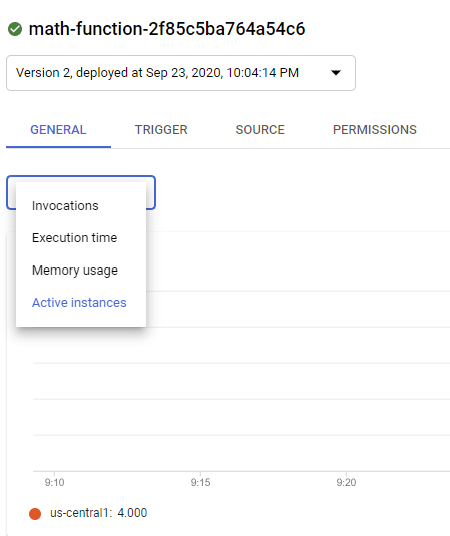

= Serverless Lab

=== Before We Start
This lab requires some Google APIs you may not have used yet. It's good to activate them first as it can take a few minutes for Google's backend systems to be aware that your account can now use these new APIs. With that in mind, fire up your Google Cloud Shell and run the following command:

[source,bash]
----
$ gcloud services enable\
    cloudbuild.googleapis.com \
    cloudfunctions.googleapis.com \
    logging.googleapis.com \
    pubsub.googleapis.com \
    storage-api.googleapis.com \
    storage-component.googleapis.com
----

== Introduction

Through the last four labs we've gone from hand-cranking our infrastructure, to configuring it with imperative scripts, to defining it in declarative fashion with tools like packer and terraform. We've also seen, at each iteration, how our infrastructure becomes more disposable, more immutable, and less precious. That hand-cranked server with no definition in code? It would be a shame to lose that since reproducing it could be a lengthy manual process. But a docker container in our Kubernetes cluster? Who cares? The system will simply spin up another one to meet the demands of our service and wire it into our existing infrastructure. And that container will look just like all the others in its cluster.

Systems like Kubernetes (or containers in general) have allowed IT shops to more rapidly deploy changes to the systems that run code. Pushing out a new container definition to your Kubernetes cluster will see relatively rapid propagation as Kubernetes deploys containters with your new image and tears down old ones. But there are limits to this. Docker containers still run on servers. Building and pushing out a new server image to a large fleet is a much more time-intensive process than pushing up a new container definition, even when that push is automated. And the servers running our container cluster will indeed need to be updated and replaced from time to time.

What if there were a way not only to deploy your infrastructure almost as quickly as your new code, but to drastically simplify the amount of infrastructure management you as the IT professional need to do? This is the idea behind **Functions as a Service (FaaS)**.

FaaS abstracts away nearly the entire compute layer and hands it off to someone else (likely a major public cloud provider like Amazon, Google or Microsoft). Think of it like wrapping your code in compute. You write a relatively simple definition for your function indicating things like:

* how much memory to use
* which code the function should run
* what permissions the function should have.

You then deploy this definition and the cloud provider takes care of the rest.

There is almost no wait for an updated infrastructure definition to match the new code it's running. The declarative code describing your function is also drastically simpler than the definition of a server and container array. Finally, there is the potential for a massive cost savings since most cloud providers only charge you for the time your function is running (down to the second). This is unlike cloud servers which, even though they add and subtract instances to match demand, always have some capacity running and costing money.

Let's deploy our first function as a service.

== Action

=== Deploy

Navigate to the `serverless-lab` directory in this repository and cat the contents of `main.tf`. What are we building? Key portions of the serverless infrastructure are identified for you via comments. Note the relative simplicity of this code as compared to a full server setup with docker containers. Take special note of which code zip is being deployed to your function. The `serverless-lab` directory has the source code in case you'd like to see the Python code our functions will be running.

* Start by altering the `project` field in `main.tf` to reflect the Google project you're currently using. Not sure of your project name? You can see a list of available projects in your account by running `gcloud projects list`. Pick the `PROJECT_ID` that matches your current project (which is usually displayed at the top left of your Google cloud dashboard)

* Deploy this terraform template. **Remember to use the upgraded version of terraform you installed during prior labs.**

Note that if you still see Google warning you about needing to activate APIs, just follow the provided link in the error message to complete any activations and then redeploy your terraform template.

Once terraform indicates your function is deployed, you have a few tasks.

First, let's describe our function and see some of its attributes.

[source,bash]
----
$ gcloud functions describe {YOUR_FUNCTION_NAME_HERE}
----

Note that we only have one deployed function and the gcloud command line will help you autocomplete. So after `describe` simply type `math` and hit the `TAB` key. You will likely see the gcloud cli fill in your function name. You can then hit `ENTER`. Examine the attributes of your new function.

Next, set your function's name as an environment variable with this command:

[source,bash]
----
$ export FUNCTION=$(gcloud functions list --format="value(httpsTrigger.url)")
----

=== Multiply

Now we can invoke our function. As currently configured, the function accepts two numbers, multiplies them, and returns the result.

We can invoke our function like this (feel free to play with the numbers you wish to multiply):

[source,bash]
----
$ curl -X POST "${FUNCTION}" -H "Content-Type:application/json" --data '{"num1": 5, "num2": 7}'
----

Note the following:

* We didn't need an SSH key. Though we made this function public for ease of access we could have limited its permissions solely with code, assigning invoke permissions to certain sets of users in our Google cloud account.
* There is no configuration around scaling. Google simply handles this for us (more on this in a bit).
* There is no server image we needed to generate with a tool like packer.
* We cannot "shell" into the server and examine anything - Google has abstracted it away. Good logging is very important for serverless functions since it is the major way to see what is going on with your code - there's no way to sneak a peak at the surrounding system to get clues.

Take a screenshot of your function invocation and the resulting output.

=== Divide

* Now alter the terraform file so that you upload the `divide.zip` package. Also set your function to use this package.

* Redeploy your terraform template with these changes

* Now call your function again. The syntax for passing in the two numbers you wish to divide is the same as before. Note that it may take just a moment for the new code to run - even though you don't need to manage the swap out of backend infrastructure, Google does. Do note, however, that you are not managing this infrastructure swap. Remember that the definition of this function and its code are immutable. So Google is not updating functions while they run - it is letting them expire and using the new function definition on new executions.

* Take a screenshot of your function invocation and the resulting output.

=== Scale

So far we've invoked our function to do some simple math. But what happens if our function needs to do things for lots of people in rapid succession. We would need it to scale to handle the load. Fortunately, Google will handle this for us in the world of serverless functions.

* Alter your terraform template once again to upload and use the `sleep.zip` code package. The code in this package is a simple function that will wait for 10 seconds before returning.

* Redeploy your terraform template with these changes.

* Next, navigate to the Google Cloud functions console and find your function. You can find the cloud functions console by opening the "hamburger" menu at the top left of your screen and scrolling down to the `compute` seciton. Examine the metrics for your function, but then find active instances metric. You'll likely see that our max number of instances at any given time is one.

* Now invoke your function again (you may omit the `--data` portion of the call along with the dictionary of numbers, but it won't hurt anything if you leave these in.) Of key importance with this invocation is to set the call as a background job in linux. Do you remember how to do this?

* You can cycle through your previous linux commands by tapping the up arrow on your keyboard. Pick out your background invocation command this way and run it very quickly 5-10 times (i.e. up-arrow, enter, up-arrow, enter, up-arrow, enter, etc.)

* Wait until all the functions return and then refresh your Google Cloud Functions console view, picking out the active instances metric again if you need to. You will likely see that Google scaled your function automatically for you to accommodate new requests while the old ones were running.

* Take a screenshot of this metric showing the multiple active instances. Be sure to include enough of the screen so we can see your function name.

=== Cleanup

When you're ready, be sure to have terraform tear down the resources you created. Note that if we walked away from this function and never invoked it, our costs would be very minimal (mostly for storage of the code in the bucket we defined). FaaS generally only charges you for the precise time your function was active. A server and container setup, on the other hand, would constantly be charging you money since you always need at least one server running to handle requests.

You should still tear down your resources.

== Discuss

Are there situations where serverless is not appropriate? As one hint, keep in mind that most FaaS providers limit the maximum time a function invocation can run. Google, for instance, caps this at nine minutes. Amazon Web Services will stop your function at 15 minutes.

== Submit

Turn in your screenshots to the Canvas assignment. You should have three in total.