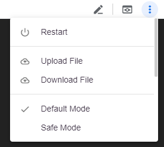
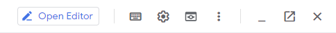
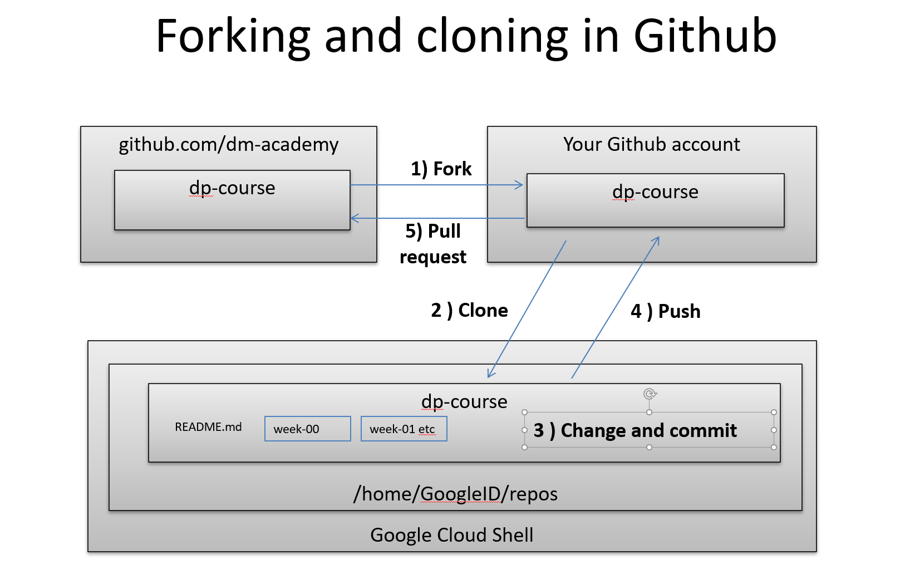

= Lab 00: Setup

NOTE: We are in a bootstrapping phase. We need to get you set up on Github and Google Cloud so that you can learn Linux. But that means you need to execute some Linux without knowing much about it. Do your best to follow the instructions. 

NOTE: These instructions are always a work in progress. 

Objectives of this lab: 

- Set up MS Teams
- Set up Google Compute Engine
- Explore the Google Cloud Shell
- Run the Linux tutorial 
- Set up Github 
- Learn basic git commands, using this course as your first repository

You will likely need to spend time on the lab in the coming week. You should complete it before you attempt the quiz. 

== A note on accounts
By the time you are done with this lab, you will have: 

* A St. Thomas email account (actually, you came in with this)
* A Github account, that should *not* have the same name as your St. Thomas email. You will configure this with public/private key authentication. 
* A Google account, for running Google Compute Engine

This is THREE different passwords, as well as a public/private key pair, with a passphrase, for Github. It's your responsibility to keep these accounts straight and NOT get confused which has what password. I recommend the use of a password keeper such as 1Password or LastPass. 

== Setting up Teams

* Teams will be the main communication channel.
* I strongly prefer questions to be posted in Teams rather than via calling me over. Leverage your classmates for support. 
* Open up Microsoft Teams
* Go to the Teams tab on the side and click the "Join or Create Team" button on the right
* Use "Join a team with a code"; the class code was sent out via Canvas announcement. 

== Accessing Google Compute Engine

For this lab we are going to work with Google Cloud and investigate the Cloud Console.

As this is your first lab, please read these instructions carefully and follow along. It may be difficult or nearly impossible to start over if you make certain key mistakes. 

=== Account Setup

IMPORTANT: YOU MUST HAVE A PERSONAL GMAIL ACCOUNT. FURTHERMORE, YOU MUST USE CHROME. Sign into your GMail and Google Cloud using Chrome only. IF YOU USE YOUR SCHOOL EMAIL, OR A DIFFERENT BROWSER, THIS WILL NOT ONLY NOT WORK, BUT YOU WILL NOT BE ABLE TO FINISH THE LAB. Go to https://mail.google.com if you don't have a personal GMail account yet. 

In the Canvas announcements there is a copy of an email from Google. Click the "Student Coupon Retrieval Link" to redeem and then read the following very carefully.

image::images/GCP-email.png[]

You will get the following:

image::images/GCP-student-webform.png[]

Your *St. Thomas email* (NOT your Gmail account) is required for the first form, this is where you will get the coupon (Google requires a valid student account with a university or college). 

Fill in your name and email. You'll get an email like this: 

image::images/eml-verify.png[]

Click on the link in the email and you should see this:

image::images/eml-verified.png[]

Finally you will get this email with your code:

image::images/eml-w-code.png[]

(Do NOT use the code in the image above. Use the code you got in your email.)

Click the link "[here]" under the code, then you will see the following page:

image::images/GCP-accept.png[]

You should be dumped to a screen that looks like this:

image::images/billing-acct.png[]

This is the Billing page. It tells you how much money you have in your account. All of your Projects will be linked to this billing account. This is how cloud computing works.

NOTE: if you get the message "Error: You don't have permission to create a billing account for your organization," switch to a personal GMail account. (We see this when people try to use work GMail accounts.) 

=== Exploring the Google Cloud Shell

We increasingly avoid any dependence on the computers in this classroom. Instead, we rely on the Google Cloud Shell, which is a specialized VM, as discussed in class. It offers a terminal emulator available in the Chrome browser when you sign into the Google Compute Engine. 

Review 

* https://cloud.google.com/shell/docs/features. 

=== Linux Introduction

IMPORTANT: A note on running tutorials. We may use other people's tutorials in this class. Sometimes you have to interpret them a bit; this is an important skill to practice. Feel free to raise issues on chat if a tutorial "doesn't make sense."

Now that you have access to the Google Cloud shell, do this tutorial (skip Tutorial 7):

http://www.ee.surrey.ac.uk/Teaching/Unix/index.html

In Tutorial 2, upload the science.txt file to your Google Cloud Shell via the "upload file" command under the triple vertical dots on the right side of the shell menu bar. Note that the tutorial makes the file available as a download as part of section 2.1. Use the file and directory commands you are learning in the tutorial to move it to a suitable location. 

If you already feel you know Linux well, review this Linux introduction. Note, it is more of an overview than a "do this, then that" tutorial. 

https://ryanstutorials.net/linuxtutorial/

It's fine if you work on the tutorial during the week, but *you need to have it completed by next week.* The quiz may cover it, so do not take the quiz until you are done with the tutorial. 

One thing neither tutorial covers is `nano`, the easiest text editor for the shell. See: 

https://www.howtogeek.com/howto/42980/the-beginners-guide-to-nano-the-linux-command-line-text-editor/

== Setting up Github account

=== Getting started

Go to http://github.com and set up a user account (one per individual, even if you are in teams). You do NOT want to use your school email account name for this, as your Github account may be an asset throughout your career. *Choose a suitably professional user name that you can use for the rest of your professional career.* 

IMPORTANT:  Please update your public profile in Github to include your name (you change it under Settings). I may have no idea otherwise who you are and can't assign credit.

Set up a private/public key pair for your Github credentials in the Google Cloud Shell. 

Review these instructions but do NOT attempt them: 

https://help.github.com/en/articles/generating-a-new-ssh-key-and-adding-it-to-the-ssh-agent

https://help.github.com/en/articles/adding-a-new-ssh-key-to-your-github-account

https://help.github.com/en/articles/testing-your-ssh-connection

This is where things get tricky. In the Google Cloud Shell, you use `ssh-keygen` to generate a public/private key pair. Using what you have learned by reading the instructions, the Linux tutorial, and any general instructions related to `ssh-keygen`, associate your Google Cloud Shell correctly with Github via public/private key authentication. 

NOTE: If you are using the Github instructions, you do NOT need Git Bash. We are working in the Google Cloud Shell; Git Bash is for your local PC. You can experiment with it sometime if you like, but it's not required. 

Here are some more detailed steps for those who are having issues: 

* Go to your Google Cloud Shell
* Execute the command `ssh-keygen -t rsa -b 4096 -C "your_email@example.com"` and accept all defaults (just hit Enter for any question, except if you are replacing a key, then hit `y`.)
** BE SURE TO CHANGE "your_email@example.com" to YOUR ACTUAL EMAIL
* Execute the command `cat ~/.ssh/id_rsa.pub` - this is your public key
* Copy the resulting string (it starts with `ssh` and ends with your email, be sure to get exactly that and nothing extra) to your clipboard
* Go to Github
* Go to your account settings
* Go to the section marked "SSH and GPG Keys"
* Create a new SSH key, naming it preferably with the date and pasting your clipboard into the large text box.

*Do NOT continue until you have ssh working.*

When you have ssh working, run this tutorial: 

https://product.hubspot.com/blog/git-and-github-tutorial-for-beginners

=== Clone this repository

A key strategy of this course is that the students contribute to the learning materials ongoing. This is essential, because the industry changes too quickly for instructors to keep up with extensive updates to materials.

Therefore, these instructions you are reading right now are something that we all collaborate on. You need to know how to change the instructions to help correct errors or add insights you may have developed as you work through them. 

When you have finished configuring your Github access and tutorials: 

- Go to Github, https://github.com/dm-academy/dp-course
- Fork this repository to your own. 
- Clone the forked version down to your Google Cloud Shell. Open that shell and type: 

[source,bash]
----
cd
mkdir repos
cd repos
git clone https://github.com/your-github-username/dp-course
----

In the above command, BE SURE TO CHANGE "your-github-username" to YOUR ACTUAL GITHUB USERNAME
Did you notice how git created a directory _inside_ the repos directory? The clone command will always create a directory to contain the new files it's brining down. That directory will automatically be named to match the github repository that you are cloning.

NOTE: I recommend keeping all git repositories in your `repos` directory.

Now, you should have all the lab files locally on your Google Cloud Shell. You can open them in nano or vi or other text editor. In this way you can change them and submit changes back to the central repo as pull requests. If nano or vi are giving you trouble, you can also use the Google Cloud Shell's native editor. You can launch the editor be clicking this button at the top right of your cloud shell screen:

Once you are done editing, you can toggle back to the cloud shell by clicking the same button, which will now read `Open Terminal`.

REQUIRED ASSIGNMENT: Try submitting a minor change as a "pull request" to the README, or any other file if you like (preferably something helpful, but you can propose any kind of change) via the techniques presented in the tutorial. Note that you will not be able to accept the change, as I am the maintainer of this file. I would have to approve. 

Here is a graphical depiction:

The basic sequence is 

. Fork
. Clone
. Change and commit
. Push
. Pull request

Here are some more details: 

*Once you have cloned down and made a small change,* execute the following commands: 

[source,bash]
----
git add . -A
git commit -m "some message"   # obviously you change this as appropriate for the change
git push origin master
----

Go up to Github and check that you can view the change in YOUR version of the dp-course repo. Then, issue a pull request back to me, by going to Pull Requests and clicking the New Pull Request button. It should default to a pull request back to dm-academy/dp-course; if it doesn't, request assistance.

Git and github could fill a course by themselves, but one key concept to keep in mind is that of the *commit*. Don't think of commiting like saving a file. Rather, think of it like adding a notation of a certain change to an existing chain of changes. If you start from the beginning and replay all of the changes in the chain, you wind up at the current state of the document. This means that advanced git commands allow you to forward and reverse through this chain of changes. More on this in lab 04.

IMPORTANT: From this point forward, you are STRONGLY ENCOURAGED to submit issues and enhancements to the course documentation. Extra credit points are readily available for contributing to the class in this manner. Don't allow yourself to "get stuck." Communicate with your classmates in MS Teams and if you are still stuck then raise a Github issue. If you are stuck, the problem is in the instructions, and we need to fix it. 
