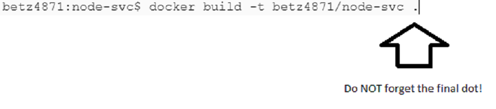
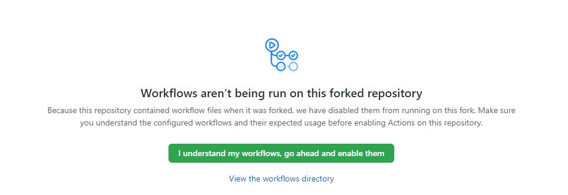
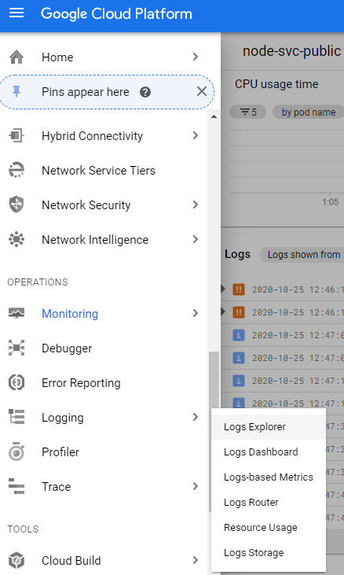
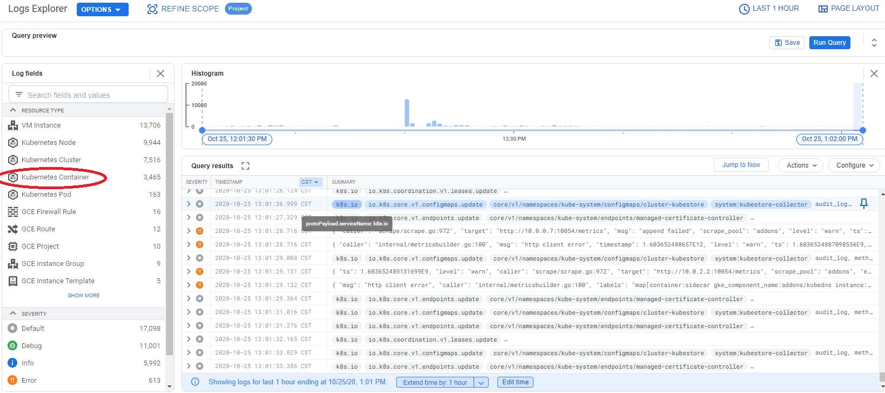
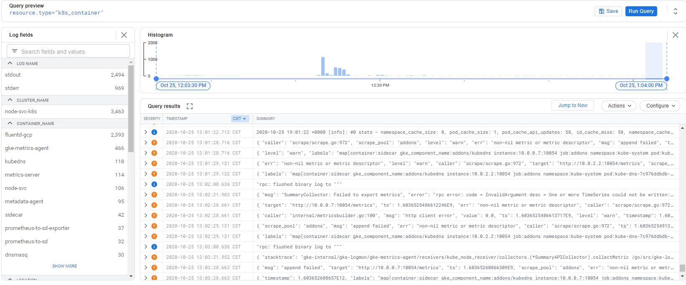
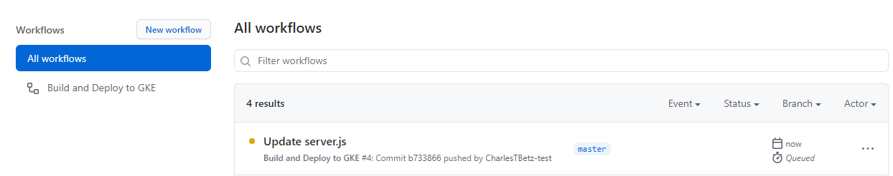
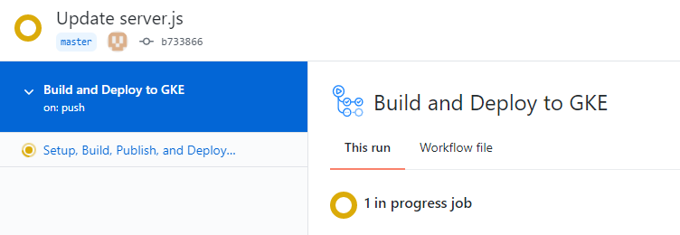
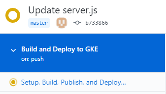
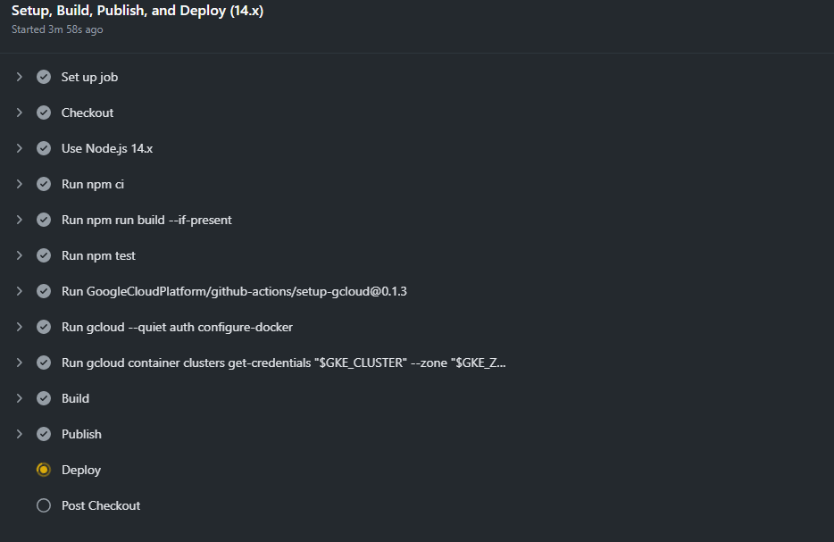
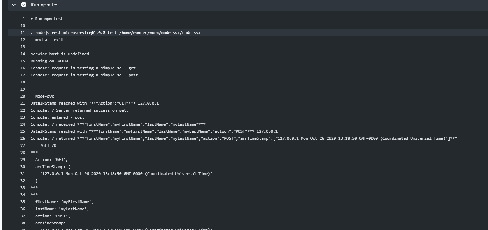

:linkattrs:

= Lab 03 UPDATED Docker, Kubernetes, and your first CD pipeline

NOTE: It is important that your node-svc instance is forked and updated correctly. Refer to Lab 04 and if you have any doubts, you should delete all previous node-svc repos both locally and on Github, and fork and clone a new one. 

Go to the node-svc directory and check out branch master: 

[source,bash]
----
$ git checkout master
----

NOTE: We are not using branch 03 for fall 2020 due to https://github.com/dm-academy/node-svc/issues/24[this issue]. This is open for extra credit if anyone can resolve.

Notice how some files disappear. That's right, we won't be using Ansible or Packer any more.

== Docker

In this section, we will talk about managing containers for the first time in this tutorial. Particularly, we will talk about https://www.docker.com/what-docker[Docker] which is the most widely used platform for running containers.

NOTE: For this section we will just run the container on the Google Cloud Shell, which can run containers locally. No VMs!

=== Intro

Remember when we talked about packer, we mentioned a few words about *Immutable Infrastructure* model? The idea was to package all application dependencies and application itself inside a machine image, so that we don't have to configure the system after start. Containers implement the same model, but they do it in a more efficient way.

Containers allow you to create self-contained isolated environments for running your applications. They have some significant advantages over VMs in terms of implementing Immutable Infrastructure model:

* *Containers are much faster to start than VMs.* Container starts in seconds, while a VM takes minutes. It's important when you're doing an update/rollback or scaling your service.
* *Containers enable better utilization of compute resources.* Very often computer resources of a VM running an application are underutilized. Launching multiple instances of the same application on one VM has a lot of difficulties: different application versions may need different versions of dependent libraries, init scripts require special configuration. With containers, running multiple instances of the same application on the same machine is easy and doesn't require any system configuration.
* *Containers are more lightweight than VMs.* Container images are much smaller than machine images, because they don't need a full operating system in order to run. In fact, a container image can include just a single binary and take just a few MBs of your disk space. This means that we need less space for storing the images and the process of distributing images goes faster.

Let's try to implement *Immutable Infrastructure* model with Docker containers, while paying special attention to the *Dockerfile* part as a way to practice *Infrastructure as Code* approach.

=== The Dockerfile
Open and review the file called Dockerfile. 

You describe a container image that you want to create in a special file called *Dockerfile*.

Dockerfile contains *instructions* on how the image should be built. Here are some of the most common instructions that you can meet in a Dockerfile:

* `FROM` is used to specify a *base image* for this build.
It's similar to the builder configuration which we defined in a Packer template, but in this case instead of describing characteristics of a VM, we simply specify a name of a container image used for build.
This should be the first instruction in the Dockerfile.
* `ADD` and `COPY` are used to copy a file/directory to the container.
See the https://stackoverflow.com/questions/24958140/what-is-the-difference-between-the-copy-and-add-commands-in-a-dockerfile[difference] between the two.
* `RUN` is used to run a command inside the image.
Mostly used for installing packages.
* `ENV` sets an environment variable available within the container.
* `WORKDIR` changes the working directory of the container to a specified path.
It basically works like a `cd` command on Linux.
* `CMD` sets a default command, which will be executed when a container starts.
This should be a command to start your application.

See how these instructions are used in the Dockerfile to create a Docker container image for our node-svc application.

This Dockerfile repeats the steps that we have done multiple times and in various ways in previous labs to configure a running environment for our application and run it.

We first choose an image that already contains Node of required version:

----
# Use base image with node installed
FROM node:11
----

The base image is downloaded from Docker official registry (storage of images) called https://hub.docker.com/[Docker Hub].

We then install required system packages and application dependencies:

----
# Install app dependencies
# A wildcard is used to ensure both package.json AND package-lock.json are copied
# where available (npm@5+)COPY package*.json ./
RUN npm install
RUN npm install express
----

Then we copy the application itself.

----
# create application home directory and copy files
COPY . /app
----

Then we specify a default command that should be run when a container from this image starts:

----
CMD [ "node", "server.js" ]
----

=== Build Container Image

Once you have reviewed how your image will be built, run the following command inside the node-svc directory to create a container image for the node-svc application:

[source,bash]
----
$ docker build -t <yourGoogleID>/node-svc .
----

What is <yourGoogleID>? See https://github.com/dm-academy/dp-course/blob/master/faq/faq.adoc[the FAQ]. 

Also. a VERY common error with the `docker build` command is omitting the final period, which indicates the current directory. (You can specify other paths as well.)

The resulting image will be named `node-svc`.
Find it in the list of your local images:

[source,bash]
----
$ docker images 
betz4871/node-svc   latest              80287ac2c4a0        36 seconds ago      950MB
node                11                  5b97b72da029        15 months ago       904MB
----

What's going on? You only created one image, but there are two. That's because Docker also pulls down and stores the base image (in this case, the image with Node installed) that you started with (review the FROM: syntax in your Dockerfile, above).

At your option, you can save your build command in a script, such as `build.sh`.

Now, run the container:

[source,bash]
----
docker run -d -p 8081:30100 <yourGoogleID>/node-svc
----

Notice the "8081:30100" syntax. This means that while the container is running on port 30100 internally, it is externally exposed via port 8081.

Again, you may wish to save this in a script, such as `run.sh`.

Now, test the container:

[source,bash]
----
$ curl localhost:8081
{"action":"GET","arrTimeStamp":["172.18.0.1 Sun Sep 06 2020 20:32:50 GMT+0000 (Coordinated Universal Time)"]}
----

Again, you may wish to save this in a script, such as `test.sh`.

Take a screen shot of your docker run and curl commands with output. Paste into a new Word document for final submission. 

=== Push container image to Google Container Registry and re-run

Right now, your image is https://www.freecodecamp.org/news/where-are-docker-images-stored-docker-container-paths-explained/[stored locally], in /var/lib/docker. This directory is cleaned out every time your Google Cloud Shell goes to sleep. 

A better practice is storing images in a dedicated container registry. The https://hub.docker.com/[Docker Hub] is a well known registry, but for convenience (and to minimize the logins you have to manage) we will store the image in the https://cloud.google.com/container-registry/[Google Container Registry]. 

IMPORTANT: In the below section, you MUST be clear on the difference between your Google ID and your Google project.  See https://github.com/dm-academy/dp-course/blob/master/faq/faq.adoc[the FAQ]!

To store an image in the Google Cloud Registry, we need to "tag" it, which in this case is more like a complete renaming.

Example: 

[source,bash]
----
$ docker tag [SOURCE_IMAGE] [HOSTNAME]/[PROJECT-ID]/[IMAGE]:TAG
$ docker push [HOSTNAME]/[PROJECT-ID]/[IMAGE]:TAG
----

We are going to now explore some environment variables to make this easier. If you type the command `env`, you will see a number of useful values. Read through them until you find your Google ID and Google Project ID. They are named LOGNAME and GOOGLE_CLOUD_PROJECT. You can access them in any command by prefacing them with `$`:

[source,bash]
----
$ docker tag $LOGNAME/node-svc gcr.io/$GOOGLE_CLOUD_PROJECT/node-svc:latest
$ docker push gcr.io/$GOOGLE_CLOUD_PROJECT/node-svc:latest
----

NOTE: This is your Google _Project_, not your Google ID that you used above. 

Notice that you can run directly: 

`$ docker run -d -p 8081:30100 gcr.io/<your Google ID>/node-svc:v1`

Having a current container image in the Google Container Registry is a prerequisite for the next section. 

=== Conclusion

In this section, you adopted containers for running your application. This is a different type of technology from what we used to deal with in the previous sections. Nevertheless, we use Infrastructure as Code approach here, too.

We describe the configuration of our container image in a Dockerfile using Dockerfile's syntax. We then save that Dockerfile in our application repository. This way we can build the application image consistently across any environments.

Destroy the current playground before moving on to the next section, through `docker ps`, `docker kill`, `docker images`, and `docker rmi`. In the example below, the container is named "beautiful_pascal". Yours will be different (and you may have multiple). Follow the example, substituting yours.

Take a screen shot of your cleanup. Paste into the Word document for final submission. 

[source,bash]
----
$ docker ps
CONTAINER ID        IMAGE                      COMMAND                  CREATED             STATUS              PORTS                    NAMES
64e60b7b0c81        <your google id>/node-svc   "docker-entrypoint.s…"   10 minutes ago      Up 10 minutes       0.0.0.0:8081->30100/tcp   beautiful_pascal
$ docker kill beautiful_pascal
beautiful_pascal
$ docker images       # returns list of your images
REPOSITORY          TAG                 IMAGE ID            CREATED             SIZE
<your goodl ID>/node-svc   latest              1faeead4d120        15 seconds ago      1.18GB
node                11                  5b97b72da029        15 months ago       904MB
$ docker rmi <your google ID>/node-svc -f
<your google ID>:node-svc$ docker rmi <your google ID>/node-svc:latest
Untagged: <your google ID>/node-svc:latest
Deleted: sha256:1faeead4d120bc99b2affe9881a9d12729b51e144df7480bfd1ace28cee55991
....
<your google ID>:node-svc$ docker images
REPOSITORY          TAG                 IMAGE ID            CREATED             SIZE
node                11                  5b97b72da029        15 months ago       904MB
<your google ID>:node-svc$ docker rmi node:11
Untagged: node:11
Untagged: node@sha256:67ca28addce8ae818b144114a9376a6603aba09069b7313618d37b38584abba1
Deleted: sha256:5b97b72da029a1d482315e3fbefef743b6bdcfb3bebbadab562111d42ba7457c

----

== Kubernetes

In the previous section, we learned how to run Docker containers locally. Running containers at scale is quite different and a special class of tools, known as *orchestrators*, are used for that task.

In this section, we'll take a look at the most popular Open Source orchestration platform called https://kubernetes.io/[Kubernetes] and see how it implements Infrastructure as Code model.

=== Intro

We used Docker to consistently create container infrastructure on one machine (our local machine). However, our production environment may include tens or hundreds of VMs to have enough capacity to provide service to a large number of users. What do you do in that case?

Questions arise as to:

* how to load balance containerized applications?
* how to perform container health checks and ensure the required number of containers is running?
* how can containers communicate securely?

The world of containers is very different from the world of virtual machines and needs a special platform for management.

Kubernetes is the most widely used orchestration platform for running and managing containers at scale. It solves the common problems (some of which we've mentioned above) related to running containers on multiple hosts. And we'll see in this section that it uses the Infrastructure as Code approach to managing container infrastructure.

Let's try to run our `node-svc` application on a Kubernetes cluster.

=== Describe Kubernetes cluster in Terraform

We'll use https://cloud.google.com/kubernetes-engine/[Google Kubernetes Engine] (GKE) service to deploy a Kubernetes cluster of 3 nodes. We'll describe a Kubernetes cluster using Terraform so that we can manage it through code.

Review these three files, which have changed since Lab 02:

[source,bash]
----
providers.tf
terraform.tfvars
main.tf
----

We'll use this Terraform code to create a Kubernetes cluster.

=== Create Kubernetes Cluster

`main.tf` holds all the information about the cluster that should be created. It's parameterized using Terraform https://www.terraform.io/intro/getting-started/variables.html[input variables] which allow you to easily change configuration parameters.

Look at the `providers.tf` file, which has a key change: 

[source,bash]
----
provider "google" {
  version = "~> 3.37.0"
  project = var.project_id
  region  = "us-central1-c"
}
----

We have changed the project to https://www.terraform.io/docs/configuration/variables.html[an input variable.] We no longer "hard code" our project ID, which should be a secret. Instead, as we see below, we "pass" the project ID on the command line

Now, run Terraform to create a Kubernetes cluster consisting of 3 nodes (VMs for running our application containers). 

[source,bash]
----
$ gcloud services enable container.googleapis.com # enable Kubernetes Engine API
$ terraform init
$ terraform apply -var "project_id=$GOOGLE_CLOUD_PROJECT" -auto-approve  # passing project on command line as environment variable.
----

Wait until Terraform finishes creation of the cluster. It can take about 3-5 minutes.

Check that the cluster is running and `kubectl` is properly configured to communicate with it by fetching cluster information:

[source,bash]
----
$ kubectl cluster-info

Kubernetes master is running at https://104.197.22.1
GLBCDefaultBackend is running at https://104.197.22.1/api/v1/namespaces/kube-system/services/default-http-backend:http/proxy
[...]
----

=== Deployment manifest

Kubernetes implements the Infrastructure as Code approach to managing container infrastructure. It uses special entities called *objects* to represent the `desired state` of your cluster. With objects you can describe

* What containerized applications are running (and on which nodes)
* The compute resources available to those applications
* The policies around how those applications behave, such as restart policies, upgrades, and fault-tolerance

By creating an object, you're effectively telling the Kubernetes system what you want your cluster's workload to look like; this is your cluster's *desired state*.
Kubernetes then makes sure that the cluster's actual state meets the desired state described in the object.

Most of the times, you describe the object in a `.yaml` file called `manifest` and then give it to `kubectl` which in turn is responsible for relaying that information to Kubernetes via its API.

*Deployment object* represents an application running on your cluster. We'll use it to run containers of our applications.

Review the `deployments.yaml` file. 

In this file we describe two `Deployment objects` which define what application containers and in what quantity should be run. The Deployment objects have the same structure so I'll briefly go over only one of them.

Each Kubernetes object has 4 required fields:

* `apiVersion` - Which version of the Kubernetes API you're using to create this object. You'll need to change that if you're using Kubernetes API version different than 1.7 as in this example.
* `kind` - What kind of object you want to create. In this case we create a Deployment object.
* `metadata` - Data that helps uniquely identify the object. In this example, we give the deployment object a name according to the name of an application it's used to run.
* `spec` - describes the `desired state` for the object. `Spec` configuration will differ from object to object, because different objects are used for different purposes.

In the Deployment object's spec we specify, how many `replicas` (instances of the same application) we want to run and what those applications are (`selector`)

[source,yml]
----
spec:
  replicas: 5
  selector:
    matchlabels:
      app: node-svc
----

In our case, we specify that we want to be running 5 instances of applications that have a lable `app=node-svc`.
*labels* are used to give identifying attributes to Kubernetes objects and can be then used by *label selectors* for objects selection.

We also specify a `Pod template` in the spec configuration. *Pods* are lower level objects than Deployments and are used to run only `a single instance of application`.
In most cases, Pod is equal to a container, although you can run multiple containers in a single Pod.

The `Pod template` which is a Pod object's definition nested inside the Deployment object.
It has the required object fields such as `metadata` and `spec`, but it doesn't have `apiVersion` and `kind` fields as those would be redundant in this case.
When we create a Deployment object, the Pod object(s) will be created as well. The number of Pods will be equal to the number of `replicas` specified. The Deployment object ensures that the right number of Pods (`replicas`) is always running.

In the Pod object definition (`Pod template`) we specify container information such as a container image name, a container name, which is used by Kubernetes to run the application. We also add labels to identify what application this Pod object is used to run, this label value is then used by the `selector` field in the Deployment object to select the right Pod object.

[source,yaml]
----
  template:
    metadata:
      labels:
        app: node-svc
    spec:
      containers:
      - name: node-svc
        image: gcr.io/<your Google ID>/node-svc:v1
----

Unfortunately, you cannot include an environment variable in YAML. So you have to alter the file.

The container image will be downloaded from the https://cloud.google.com/container-registry/[Google Container Registry] (this is the one we tagged and uploaded as v1 in the previous section).

=== Create Deployment Objects

In the file deployments.yaml change the Google project ID on the "image" line to match your Google project id (the full path should match the Docker tagged image at the end of the previous section in this lab).

Then, run a kubectl command to create Deployment objects inside your Kubernetes cluster (make sure to provide the correct path to the manifest file):

[source,bash]
----
$ kubectl apply -f my-deployments.yaml
----
It can take 5 minutes or more for the pods to be fully activated. Take a quick break, and then check the deployments and pods that have been created:

*Pods at start:*

[source,bash]
----
$ kubectl get deploy
NAME                  READY   UP-TO-DATE   AVAILABLE   AGE
node-svc-deployment   0/5     5            0           51s
$ kubectl get pods
NAME                                   READY   STATUS              RESTARTS   AGE
node-svc-deployment-547f9d4c7f-45zqv   0/1     ContainerCreating   0          59s
node-svc-deployment-547f9d4c7f-58brr   0/1     ContainerCreating   0          59s
node-svc-deployment-547f9d4c7f-b5kjz   0/1     ContainerCreating   0          59s
node-svc-deployment-547f9d4c7f-l9m7m   0/1     ContainerCreating   0          59s
node-svc-deployment-547f9d4c7f-mrg6m   0/1     ContainerCreating   0          59s
----

*Pods still creating:*

[source,bash]
----
$ kubectl get deploy
NAME                  READY   UP-TO-DATE   AVAILABLE   AGE
node-svc-deployment   2/5     5            2           51s
$ kubectl get pods
NAME                                   READY   STATUS              RESTARTS   AGE
node-svc-deployment-547f9d4c7f-45zqv   1/1     Running             0          59s
node-svc-deployment-547f9d4c7f-58brr   0/1     ContainerCreating   0          59s
node-svc-deployment-547f9d4c7f-b5kjz   1/1     Running             0          59s
node-svc-deployment-547f9d4c7f-l9m7m   0/1     ContainerCreating   0          59s
node-svc-deployment-547f9d4c7f-mrg6m   0/1     ContainerCreating   0          59s
----

*All pods ready*
[source,bash]
----
$ kubectl get deploy
NAME                  READY   UP-TO-DATE   AVAILABLE   AGE
node-svc-deployment   5/5     5            5           4m1s
$ kubectl get pods
NAME                                   READY   STATUS              RESTARTS   AGE
node-svc-deployment-7ff4459995-4zxcv   1/1     Running             0          4m3s
node-svc-deployment-7ff4459995-5dmtq   1/1     Running             0          4m3s
node-svc-deployment-7ff4459995-l8bch   1/1     Running             0          4m3s
node-svc-deployment-7ff4459995-m6p67   1/1     Running             0          4m3s
node-svc-deployment-7ff4459995-s7nsb   1/1     Running             0          4m3s
----

=== Service manifests

Running applications at scale means running _multiple containers spread across multiple VMs_. This gives rise to questions such as: 

* How do we load balance between all of these application containers?
* How do we provide a single entry point for the application so that we could connect to it via that entry point instead of connecting to a particular container?

These questions are addressed by the *Service* object in Kubernetes. A Service is an abstraction which you can use to logically group containers (Pods) running in you cluster, that all provide the same functionality.

When a Service object is created, it is assigned a unique IP address called `clusterIP` (a single entry point for our application). Other Pods can then be configured to talk to the Service, and the Service will load balance the requests to containers (Pods) that are members of that Service.

So we create a Service for the node-svc applications.

Review the file called `services.yaml` inside `node-svc` directory with the following content:

[source,yaml]
----
apiVersion: v1
kind: Service
metadata:
  name: node-svc-public
spec:
  type: NodePort
  selector:
    app: node-svc
  ports:
  - protocol: TCP
    port: 30100
    targetPort: 30100
    nodePort: 30100
----

In this manifest, we describe the node-svc object.

You should be already familiar with the general object structure, so I'll just go over the `spec` field which defines the desired state of the object.

The `node-svc` Service has a NodePort type:

[source,yaml]
----
spec:
  type: NodePort
----

This type of Service makes the Service accessible on each Node's IP at a static port (NodePort). We use this type to be able to contact the `node-svc` application later from outside the cluster.

`selector` field is used to identify a set of Pods to which to route packets that the Service receives.
In this case, Pods that have a label `app=node-svc` will become part of this Service.

[source,yaml]
----
  selector:
    app: node-svc
----

The `ports` section specifies the port mapping between a Service and Pods that are part of this Service and also contains definition of a node port number (`nodePort`) which we will use to reach the Service from outside the cluster.

[source,yaml]
----
  ports:
  - protocol: TCP
    port: 30100
    targetPort: 30100
    nodePort: 30100
----

The requests that come to any of your cluster nodes' public IP addresses on the specified `nodePort` will be routed to the `node-svc` Service cluster-internal IP address. The Service, which is listening on port 30100 (`port`) and is accessible within the cluster on this port, will then route the packets to the `targetPort` on one of the Pods which is part of this Service.

For simplcity, we have used the same port for all three, but they may all differ.

=== Create Service Objects

Run a kubectl command to create Service objects inside your Kubernetes cluster (make sure to provide the correct path to the manifest file):

[source,bash]
----
$ kubectl apply -f services.yaml
----

Check that the services have been created:

[source,bash]
----
$ kubectl get svc
NAME              TYPE        CLUSTER-IP     EXTERNAL-IP   PORT(S)           AGE
kubernetes        ClusterIP   10.3.240.1     <none>        443/TCP           11m
node-svc-public   NodePort    10.3.245.179   <none>        30100:30100/TCP   7s
----

(The IP addresses will be different for yours.)

=== Access Application

Because we used `NodePort` type of service for the `node-svc` service, our application should accessible to us on the IP address of any of our cluster nodes.

NOTE: It may take up to 3 minutes for Kubernetes to launch your containers.   

Get a list of IP addresses of your cluster nodes:

[source,bash]
----
$ gcloud --format="value(networkInterfaces[0].accessConfigs[0].natIP)" compute instances list --filter="tags.items=node-svc-k8s"
----

Use any of your nodes public IP addresses and the node port `30100` which we specified in the service object definition to reach the `node-svc` application by issuing the appropriate curl command (or accessing via your browser):

$ curl <cluster IP>:30100

At this time, do not try a higher number (e.g. <cluster IP>:30100/2)

Take a screenshot of the results and submit to the lab assignment. 

=== Conclusion

In this section, we learned about Kubernetes - a popular orchestration platform which simplifies the process of running containers at scale. We saw how it implements the Infrastructure as Code approach in the form of `objects` and `manifests` which allow you to describe in code the desired state of your container infrastructure which spans a cluster of VMs.

== Automating the delivery pipeline

Now that we have a working application that can be deployed to Kubernetes, we can automate the delivery pipeline. It's now time to start using Github Actions so that we can easily move changes into the cluster, without having to execute a lot of commands. 

We'll start with automated testing. As discussed in the DPBoK, we are continually evolving our systems, and as we make changes, we need the systems to keep their existing functionality.

=== Automated testing

In the node-svc directory there is a `test` directory, with a file in it called `test.js`. Have a look at it. It is a very basic automated test that checks that `server.js` operates and successfully responds to a simple GET. 

You can run the test by simply typing `npm test`. Try it.

NOTE: If you have issues, you may need to perform `npm install`.

== Updating the service: towards a true pipeline

In the last section, we were able to access the application's main URL. Also, at this point the simple URL  is working .... but /1, /3, /30 etc are not. We need to: 

* figure out what's wrong
* update server.js
* test it locally (either directly or as a container)
* rebuild the container
* push it to the Google Container Registry
* tell Kubernetes to re-apply the deployment. 

You'll quickly realize this is a set of often repeated actions. We're now ready for continuous delivery (to be continued...)

=== Continuous delivery 

Review https://pubs.opengroup.org/dpbok/standard/DPBoK.html#KLP-devops-technical-practices[DevOps Technical Practices] in the DPBoK. 

In your directory, you will also find a directory called `.github,` with a subdirectory `workflows` and a file `GKE.yml`. The file is a Github Actions script. Have a look at it. It's a basic pipeline, including: 

* testing the application
* building the Docker image
* pushing the Docker image to the Google Container Registry (GCR). 
* deploying from the GCR to Kubernetes

Your final task for this lab is to configure your Github repository to run the pipeline. 

Go to the "Actions" tab in your fork of the node-svc repository and enable your workflows: 

Next, see https://github.com/GoogleCloudPlatform/github-actions/tree/master/example-workflows/gke[this page.]

As the page indicates, you need to enable the appropriate APIs, create a service account, download the JSON service account key and configure the appropriate secrets in the repository Settings:

* GKE_PROJECT
* GKE_SA_KEY

NOTE: Keep the service account key in a secure location, such as a password manager. It is equivalent to an ssh private key. Once you put it into Github, you cannot retrieve it. 

Once you have this configured, the pipeline should run whenever you make a change to server.js and push it to your Github repo (a local change isn't sufficient). Try changing the output of `app.get('/0?'..` as suggested in the code comments.

=== Break/fix analysis
It's one thing to fix code that you're developing on your workstation. It's another thing entirely to fix code that is breaking in production. In this case, you have a service that worked fine on both VMs and Docker, but is ony partially functional in Kubernetes. 

The first question you should always ask in this situation: what do the logs say? 

First, what is a log? It is a record of what the system is doing. Remember stdout and stderr from your Unix tutorial? (Review them if you don't.) These output streams are usually being monitored and recorded when software is deployed and started in a running system. Kubernetes is no exception. 

The simplest way to get Kubernetes logs is as follows. First, try the command once more: 

`$ curl <cluster IP>:30100/3`

It should hang; hit ctrl-c. Repeat a few more times, so that the first pod is likely to see the error.

Google Cloud has extensive monitoring. From the left top "hamburger" (the three lines) to the left of "Google Cloud Platform," select "Operations|Logging|Logs Explorer":

You should see something like this: 

Click on "Kubernetes Container" (circled), you should see something like:

You're now seeing the combination of stderr and stdout for your containers. Look at the orange !! warnings. What are they saying? 

In particular, we are interested in the errors that start with "UnhandledPromiseRejectionWarning..." We see some calls to IP addresses that seem to be timing out (ETIMEDOUT error). Look in your source code for server.js. Does that IP address seem to be there somewhere? Like Line 5?

This is an example of a hard-coded value that is now breaking. We could replace it with a current cluster IP address, but then we have to just keep updating the code every time. Clearly, there should be a better way. Fortunately there is a simple fix, we just need to uncomment the appropriate line in server.js. Review it and do so. 

Push the updated server.js file to the master branch in your Github repository (or make the change on line on Github itself). This should kick off the pipeline and result in your Kubernetes cluster being automatically updated with the new file. 

To see the pipeline in action, go to Actions and click on "Build and Deploy to GKE." You'll see the workflows that kick off with each commit to master. 

Click on 

Click on the top result which should say "Update server.js." You should see something like this:

Then click on "Setup Build, Publish, and Deploy." 

This is where you get to see the real cool stuff:

You can click any of the ">" symbols for more information: 

=== Submitting evidence

Take a screenshot of the pipeline page showing that it has successfully run all steps, and a screen shot showing a /20 or greater call to the microservices running on the Kubernetes cluster (either via browser or curl). 

=== Destroy the cluster

To destroy the Kubernetes cluster, run the following command inside `kubernetes/terraform` directory:

[source,bash]
----
$ terraform destroy -auto-approve
----

