= Lab 04 Product management and Github

This is an unusual lab, as it includes a transition in our way of working with Github that will become the basis of the course going forward (next year, the class will start with the updated approach.) But operational changes are routine in IT organizations and so this is consistent with the course's overall educational objectives. 

==  Upping our Git collaboration

To continue with Git, you MUST have ssh configured. If you are still typing in a username and password, you must go back to lab 00 and complete the ssh section. Note that this section was enhanced since week 00. Do NOT do anything else until you have successfully set up ssh. 

IMPORTANT: Because (fall 2020) many of you did not complete configuring ssh for github, I am requiring that you upload the output of this command: 

`$ ssh -T git@github.com`

You may see a warning like this:

[source,bash]
----
The authenticity of host 'github.com (IP ADDRESS)' can't be established.
RSA key fingerprint is 16:27:ac:a5:76:28:2d:36:63:1b:56:4d:eb:df:a6:48.
Are you sure you want to continue connecting (yes/no)?
----
or like this:

[source,bash]
----
The authenticity of host 'github.com (IP ADDRESS)' can't be established.
RSA key fingerprint is SHA256:nThbg6kXUpJWGl7E1IGOCspRomTxdCARLviKw6E5SY8.
Are you sure you want to continue connecting (yes/no)?
----

Verify that the fingerprint in the message you see matches one of the messages in step 2, then type yes:

[source,bash]
----
Hi username! You've successfully authenticated, but GitHub does not provide shell access.
----

Verify that the resulting message contains your username. If you receive a "permission denied" message, see https://github.com/dm-academy/dp-course/blob/master/faq.adoc[the FAQ] or https://docs.github.com/en/free-pro-team@latest/github/authenticating-to-github/error-permission-denied-publickey[this Github advice].

Again, take a screenshot and add to the Lab 04 assignment submission. 

== Taking stock

In the middle section of this lab, we will take a bit of a break from the technicalities and spend some time reviewing the overall vision for the course as a product, and expanding out Github skills. (Instructor lecture and discussion.)

Then we will spend the rest of the lab honing our git and Github skills.

== Direct cloning and collaboration
We are going to change our approach for collaborating on dpcourse. Since it does not run github actions, there is no need to maintain a fork. 

=== SEIS664-20YY-MM team
You all are now members, or will be members of a Github team named SEIS664-20YY-MM where YY is the year and MM is the month the class started (either 02 for spring or 09 for fall.)

You have privileges to create issues, forks, and pull requests on both dp-course and node-svc. 

=== Re-cloning, NOT as a fork

On Github, go to your account and go into the forked dp-course repository go into its Settings, scroll all the way down, and *delete* it. You will have to re-type the repository name and re-enter your password. 
* Then, go to https://github.com/dm-academy/dp-course and find the SSH clone address under the "Code" button, like so:

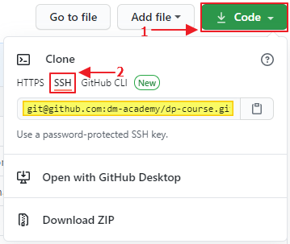

git clone DIRECTLY to your local `repos` directory on Google Cloud Shell by issuing the following command:
----
$ git clone git@github.com:dm-academy/dp-course.git
----
NOTE: We are using the SSH address from the above screenshot for this command. If you clone the URL "https://github.com/dm-academy/dp-course", your push and fetch URLs will default to the "https" address. This means you will not be using SSH when making changes to this branch.

Be sure you are inside the parent directory where you want the dp-course local copy to go. For instance, if you are cloning all of your work into a `/repos` directory, ensure you are there before running the clone command. The dp-course repo will then show up like this: `~/repos/dp-course`.

NOTE: If you already had a dp-course directory in ~/repos, you need to delete it with `sudo rm -rf dp-course`

You now have a repo that you can directly create issues, branches, and pull requests for. This is the most common way of managing collaboration with git and derivative platforms; forking is not as commonly used, especially in organizational contexts (it's mostly an open source thing).  

IMPORTANT: You *cannot* directly push to master; I (or another administrator) have to review and approve the pull request. 

== Github issues, branches, and pull requests

Here is an overview of the following sections: The following image is for dp-course. 

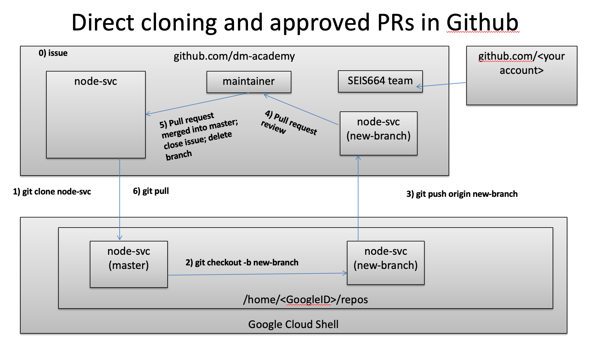

Now that we have discussed the overall vision for the course repositories, we are going to start using Github issues to communicate more, instead of relying on Teams for everything. If you think you have discovered a problem in a lab, you should file a Github issue. To finish this lab, follow this example, or preferably come up with your own improvement to the course materials. 

Here are the steps for filing a Github issue, and fixing it via a branch and pull request. 

Something that I thought of last night (2020-10-09) was that we never really talk about nano. I want to put a link into the lab 00 instructions so people can at least access basic how-tos. 

For the purposes of this exercise, I am not just going to fix it directly. I am going to raise an issue, assign it to myself, fix it, and submit a pull request to ... me!

In other words, I am operating first as "CharlesTBetz-test" which is a Github account I created that has no more rights than any of you. Acting as such, I have cloned dm-academy/dp-course down to my Google Cloud Shell, and I am only logged into my ssh agent with the private key associated with CharlesTBetz-test. 

So, how do I let the project know I think we should provide a pointer to nano instructions? Rather than making a technical change, I am first going to communicate that we have a problem. 

This is an important step now that we are operating as a team. What I think is a problem, might not be. Someone else might already be working on it. So it is very important to communicate before starting technical work. 

=== Create an issue 
First, I go to 

https://github.com/dm-academy/dp-course,

click on "Issues"  

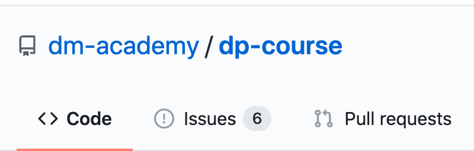

and then the "New Issue" button that appears on the right. 

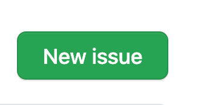

I document my issue:

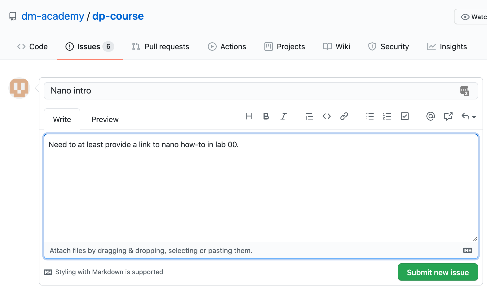

(Note that the issue appears as a word bubble coming from my icon as CharlesTBetz-test.)

I see on the right I can assign an owner ("Assignees"):

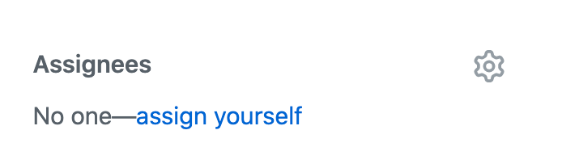. 

I click "Submit new issue." 

=== Assign it

Since I (as CharlesTBetz-test) belong to the dm-academy/node-svc repo with sufficient privileges, I can assign the issue to myself. 

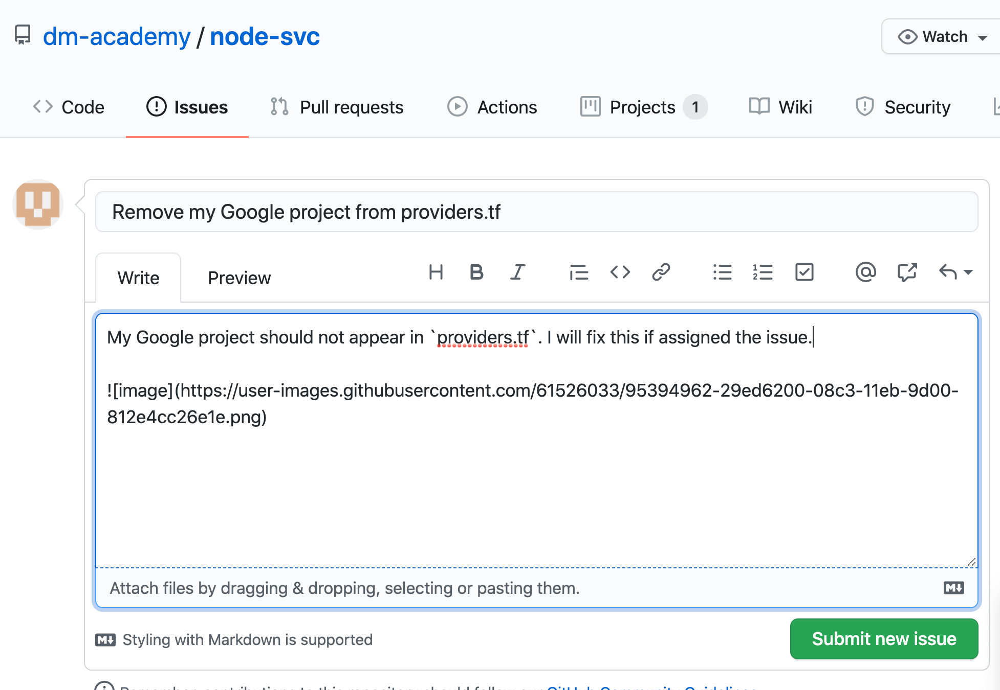

I click on Assign Myself, and I am assigned. 

I click on Submit New Issue: 

and the issue is created. It was given #44, this will be useful below.

It is also possible to create an issue directly out of Teams, using "chatops" techniques. We will cover this subsequently. 

=== Create a branch

NOTE: We've been using Gitlab for the Open Group which allows the immediate creation of a branch on creation of an issue. Github doesn't do this, which I see as a disadvantage. 

Now that I've been assigned the issue, I am going to create a local branch. I could do this on the website as well. 

I leave the Github UI and go to my Google Cloud Shell, where in the repos/dp-course direcgory I type: 

[source, bash]
----
`$ git checkout -b nano-fix`
Switched to a new branch 'nano-fix'
----

I could also have created the branch first via `git branch` and then checked it out. The -b flag lets me do both. I also could have created the branch in the Github GUI. 

Now, I can fix the issue. 

`$ nano week-00/00-tech-lab.adoc`

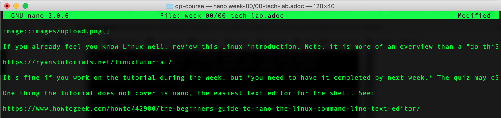

=== Commit, push, and create a pull request

Now, it's time to commit, push, and create a pull request: 

[source, bash]
----
$ git add . -A
$ git commit -m "fixes nano issue #44"
[provider-fix 8d1ed0a] fixes issue #44
 1 file changed, 1 insertion(+), 1 deletion(-)
$ git push origin master
Everything up-to-date
----
Oops, that was a mistake. We need to git push origin <branch name>.

[source,bash]
----
2019-MBA:dp-course char$ git push origin nano-fix
Enumerating objects: 16, done.
Counting objects: 100% (16/16), done.
Delta compression using up to 4 threads
Compressing objects: 100% (10/10), done.
Writing objects: 100% (10/10), 655.71 KiB | 15.61 MiB/s, done.
Total 10 (delta 3), reused 0 (delta 0)
remote: Resolving deltas: 100% (3/3), completed with 3 local objects.
remote: 
remote: Create a pull request for 'nano-fix' on GitHub by visiting:
remote:      https://github.com/dm-academy/dp-course/pull/new/nano-fix
remote: 
To github.com:dm-academy/dp-course.git
 * [new branch]      nano-fix -> nano-fix
2019-MBA:dp-course char$ 
----

Now, if I go to github and look at the 00-lab file:

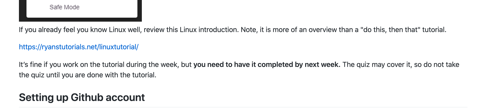

it's not fixed. 

BUT ... look at the branches. Aha, I was still on master: 

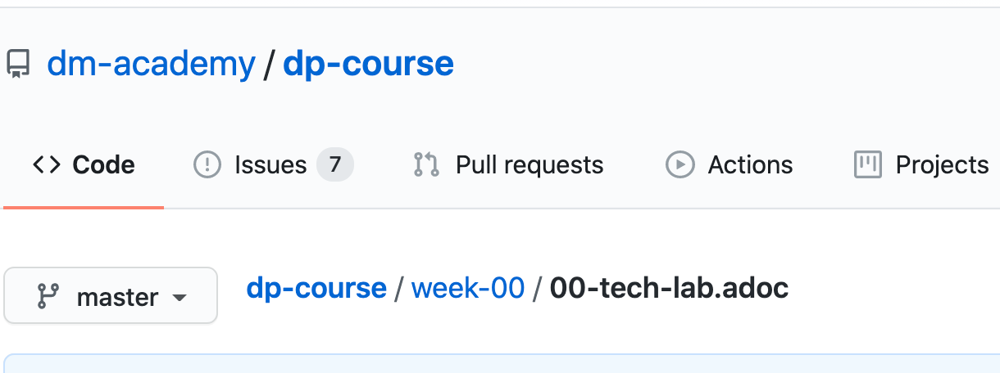

Switch to "nano-fix" and the new material is there: 

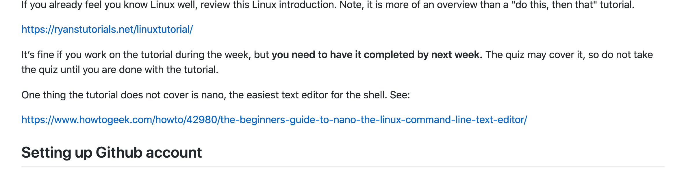

But how do I get it into master? I need to issue a *pull request* to me as the maintainer. Fortunately, if I look above at my console output when I did the git push -- very nice, Github has given us a very cool link to go and create a pull request (). I paste it into my browser: 

https://github.com/dm-academy/dp-course/pull/new/nano-fix

and fill it out thus, requesting a review on the right (from me as maintainer): 

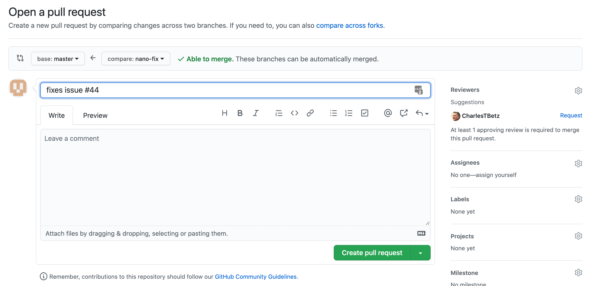

I switch to my maintainer account and approve and merge it. The issue can also be now closed. 

NOTE: What happens if, while your pull request is waiting to be merged, a different pull request that modifies some of the same lines of code is merged? You'll get a merge conflict. A merge conflict is when git can't reconcile the differences between what you're asking to merge and what someone else recently changed in the same file. You'll get a screen in github that looks like this:
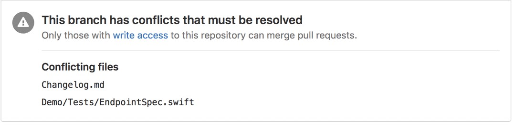
In this case, you'll need to decide which changes should remain in the branch you're merging to.

== Setting upstream remote for node-svc

Up until now, we have been somewhat haphazard and basic with our usage of git and Github, just as a startup with a couple of individuals might be -- primarily using it as a repository/archive, but not very effectively as a collaboration tool. 

In particular we have been using this basic approach: 

image:../week-00/images/github-arch.png[]

The problem with this approach is that there is no convenient way to pull updates from upstream into our local repo. 

There are two ways we can solve this. 

1. I could make you all members of my Github project and you could clone it directly. However, then you cannot run Github Actions yourself.
2. We can continue to have you fork and then clone (as you would if you were participating in an open source project for which you were not yet a committer) but set things up so that you can do it all from the command line. 

We will go with option #2. 

In order to proceed with #2, we need to better understand the concept of a git "remote." Git is a powerful tool for distributed collaboration on complex software projects, and therefore itself is complex. 

According to https://www.git-tower.com/, "A remote in Git is a common repository that all team members use to exchange their changes. In most cases, such a remote repository is stored on a code hosting service like GitHub or on an internal server."

What this does not mention is that a git repository can have _multiple_ remotes. Your local clone on the Google Cloud Shell has, as a remote, the fork you created in Github. This is its origin.  Now, you are going to set as your _upstream_ remote the original source repository you cloned from as a template. 

(This lab is based on these instructions: https://docs.github.com/en/free-pro-team@latest/github/collaborating-with-issues-and-pull-requests/configuring-a-remote-for-a-fork)

So, let's configure a remote for node-svc. 

Go to your `repos` directory (or wherever you have put the repos). Enter (`cd`) into the node-svc repo, if you aren't there already from the last step. 

At the command prompt, enter: 

`git remote add upstream https://github.com/dm-academy/node-svc`

This adds the original repo as the `upstream` remote. You still have the `origin remote`, under _your_ GitHub account. 

I have done so using a test Github account called CharlesTBetz-test. I can see the result thus: 

[source,bash]
----
betz4871:node-svc$ git remote -v
origin  git@github.com:CharlesTBetz-test/node-svc.git (fetch)
origin  git@github.com:CharlesTBetz-test/node-svc.git (push)
upstream        https://github.com/dm-academy/node-svc (fetch)
upstream        https://github.com/dm-academy/node-svc (push)
betz4871:node-svc$
----

Notice there is both an `origin` and `upstream` remote. Examine the URLs for each. One points to the dm-academy master repo, the other points to its forked replica on my test account. 

Let's synch things up: 

`git pull upstream master`

Unless you have changed your local copy, or upstream has changed since you forked and cloned, this should indicate that everything is up to date. 

The overall architecture now looks like this (notice 6 and 7):

image:images/Github-v2.png[]

From now on, before pushing any changes and especially before issuing a pull request, be sure to synch your local copy with upstream. 

IMPORTANT: It is convenient to sync your online git repo with upstream by just pushing the changes from your local repo (7 + 4). You also can compare across upstream and your fork and merge changes directly on Github (8 + 5). 

Here is the final configuration you should have: 

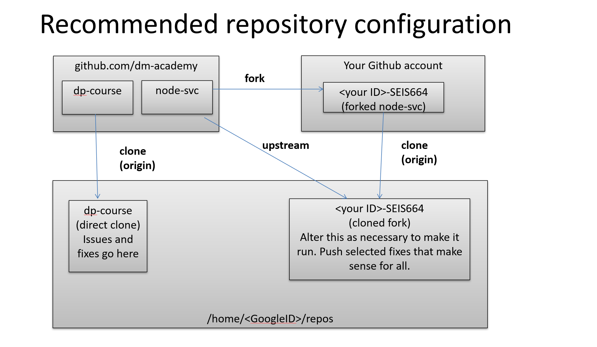

If the instructor indicates that a change from dm-academy/node-svc needs to be pulled into your local version, execute the following: 

[source,bash]
----
$ git fetch upstream  # pull down changes from dm-academy/node-svc
$ git reset --hard upstream/master   # or perhaps a different branch, e.g. /03
$ git push --force  # update your copy on Github
----

Notice that this will discard any changes you have made locally. 

=== Assignment

Assignment: Using what you have learned above, find some small BUT REAL thing to fix in either dp-course or node-svc. It can be as simple as fixing a mis-spelling or grammar, or adding some clarifying language. If you truly cannot find anything to improve, just subsitute a synonym for some work in dp-course. 

Optionally, you may also raise an issue, branch, and pull request on the https://gitlab.com/theopengroup/dpbok-community-edition[community edition of the DPBoK]. I will grant extra credit for this. 

In the assignment submission on Canvas, paste the link to the pull request (PR) for the change you made. 

=== Further reading

* https://docs.github.com/en/free-pro-team@latest/github/collaborating-with-issues-and-pull-requests/configuring-a-remote-for-a-fork

* https://docs.github.com/en/free-pro-team@latest/github/collaborating-with-issues-and-pull-requests/syncing-a-fork

* https://docs.github.com/en/free-pro-team@latest/github/collaborating-with-issues-and-pull-requests/creating-a-pull-request-from-a-fork

* https://www.freecodecamp.org/news/how-to-delete-a-git-branch-both-locally-and-remotely/

* https://www.freecodecamp.org/news/git-pull-force-how-to-overwrite-local-changes-with-git/

https://github.community/t/syncing-a-fork-leaves-me-one-commit-ahead-of-upstream-master/1435
