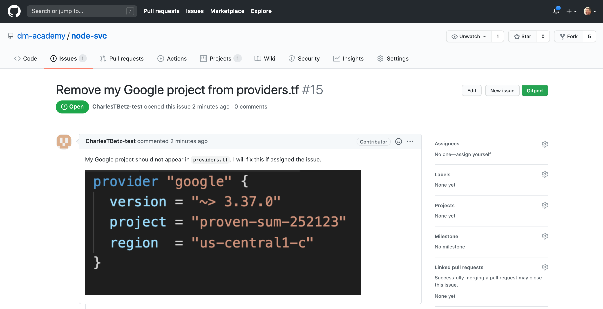
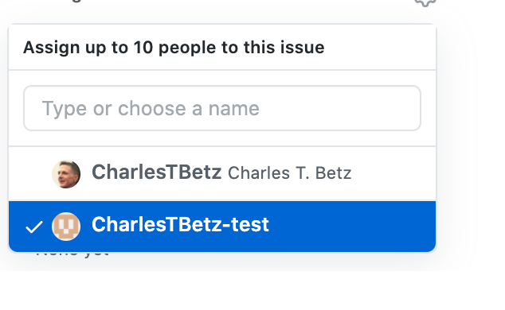

= Lab 04 Product management

==  Upping our Git collaboration

Important: To continue with Git, you MUST have ssh configured. If you are still typing in a username and password, you must go back to lab 00 and complete the ssh section. Note that this section was enhanced since week 00. Do NOT do anything else until you have successfully set up ssh. 

IMPORTANT: Because (fall 2020) many of you did not complete configuring ssh for github, I am requiring that you upload the output of this command: 

`$ ssh -T git@github.com`

You may see a warning like this:

[source,bash]
----
The authenticity of host 'github.com (IP ADDRESS)' can't be established.
RSA key fingerprint is 16:27:ac:a5:76:28:2d:36:63:1b:56:4d:eb:df:a6:48.
Are you sure you want to continue connecting (yes/no)?
----

or like this:

[source,bash]
----
The authenticity of host 'github.com (IP ADDRESS)' can't be established.
RSA key fingerprint is SHA256:nThbg6kXUpJWGl7E1IGOCspRomTxdCARLviKw6E5SY8.
Are you sure you want to continue connecting (yes/no)?
----

Verify that the fingerprint in the message you see matches one of the messages in step 2, then type yes:

[source,bash]
----
Hi username! You've successfully authenticated, but GitHub does not provide shell access.

----

Verify that the resulting message contains your username. If you receive a "permission denied" message, see https://github.com/dm-academy/dp-course/blob/master/faq.adoc[the FAQ] or https://docs.github.com/en/free-pro-team@latest/github/authenticating-to-github/error-permission-denied-publickey[this Github advice].

Again, take a screenshot and add to the Lab 04 assignment submission. 

=== SEIS664-20YY-MM team
You all are now members, or will be members of a Github team named SEIS664-20YY-MM where YY is the year and MM is the month the class started (either 02 for spring or 09 for fall.)

NOTE: (Fall 2020 only, delete after) Because of this, we will no longer be forking and then cloning. You are members of the organization directly. 

=== Re-cloning, NOT as a fork

NOTE: I thought the Github template functionality would be more efficient, as it does not include history. But this causes more issues than it solves. So, for Fall 2020 *only*, we need to archive our working repositories and re-clone, neither as templates nor forks.

To fix this: 

You should have two repositories at this point, a copy of dp-course (the course repo, what you are reading right now) and a copy of node-svc that you forked from a template and renamed using your St. Thomas ID. 

The copy of node-svc is the problem. It doesn't share a history with node-svc which means it's hard to sync them up. 

You may have some useful work in your existing repository, so we want to save it locally but delete it on Github. So, 

* Leave it in your local `repos` directory on the Google Cloud Shell as named
* But on Github, go to your account and go into the repository <my St Thomas ID>-SEIS664 (or whatever you called it), go into its Settings, scroll all the way down, and *delete* it. You will have to re-type the repository name and re-enter your password. 
* Do the same for your fork of dp-course. 
* Then, go to https://github.com/dm-academy/node-svc and copy the clone address and git clone to your local `repos` directory on Google Cloud Shell. 
* Do this also for https://github.com/dm-academy/dp-course. 

You now have two repos that you can directly create issues, branches, and pull requests for. However, you *cannot* directly push to master; I (or another administrator) have to review and approve the pull request. This is the most common way of managing collaboration with git and derivative platforms; forking is not as commonly used, especially in organizational contexts (it's mostly an open source thing).  

== Taking stock

In the remainder of this lab, we will take a bit of a break from the technicalities and spend some time reviewing the overall vision for the course as a product, and expanding out Github skills. 

== Github issues, branches, and pull requests

Now that we have discussed the overall vision for the course repositories, we are going to start using Github issues to communicate more, instead of relying on Teams for everything. If you think you have discovered a problem in a lab, you should file a Github issue. To finish this lab, follow this example, or preferably come up with your own improvement to the course materials. 

Here are the steps for filing a Github issue, and fixing it via a branch and pull request. 

Let's say I'm looking at a local clone of 

https://github.com/CharlesTBetz-test/node-svc

which is a fork of 

https://github.com/dm-academy/node-svc. 

At this writing, I see: 

[source, bash]
----
provider "google" {
  version = "~> 3.37.0"
  project = "proven-sum-252123"
  region  = "us-central1-c"
}
----

I do not like this, my Google project ID should not appear here. But for the purposes of this exercise, I am not just going to fix it directly. I am going to raise an issue, assign it to myself, fix it, and submit a pull request to ... me!

In other words, I am operating first as "CharlesTBetz-test" which is a Github account I created that has no more rights than any of you. Acting as such, I have forked the master dm-academy/node-svc repo and cloned it down to my Google Cloud Shell. 

So, how do I let the open source project know it should not be using my personal project ID? Rather than making a technical change, I am first going to communicate that we have a problem. 

This is an important step now that we are operating as a team. What I think is a problem, might not be. Someone else might already be working on it. So it is very important to communicate before starting technical work. 

=== Create an issue 
I can't create an issue on a forked repo; I can only create an issue on the original. So I go to 

https://github.com/dm-academy/node-svc,

click on "Issues"  

image:images/issues.png[]

and then the "New Issue" button that appears on the right. 

image:images/issueBtn.png[]

I document my issue:

image:images/providersIssue.png[]

(Note that the issue appears as a word bubble coming from my icon as CharlesTBetz-test.)

I took a screen shot and pasted it in. It appears as the ![image]... line. Nice feature. 

I click "Submit new issue." 

=== Assign it

As a non-member of the node-svc project  (CharlesTBetz-test) I cannot assign the issue to myself. So I switch to my "real" account, CharlesTBetz, and open the issue: 

Notice top right the small picture of my face - this lets me know I am accessing as CharlesTBetz, not CharlesTBetz-test. 

I click on Assignees and see that I can assign either of my personas. I choose CharlesTBetz-test. 

(I will have to do this for each of you, until I assign some additional committers or maintainers)

=== Create a branch

NOTE: We've been using Gitlab for the Open Group which allows the immediate creation of a branch on creation of an issue. Github doesn't do this, which I see as a disadvantage. 

Now that I've been assigned the issue, I am going to create a local branch.

=== Create a pull request

=== Merge it (as committer) and clean up

Assignment: Using what you have learned above, find some small thing to fix in either dp-course or node-svc. It can be as simple as fixing a mis-spelling or grammar, or adding some clarifying language. If you truly cannot find anything to improve, just subsitute a synonym for some work in dp-course. 

Optionally, you may also raise an issue, branch, and pull request on the https://gitlab.com/theopengroup/dpbok-community-edition[community edition of the DPBoK]. I will grant extra credit for this. 

