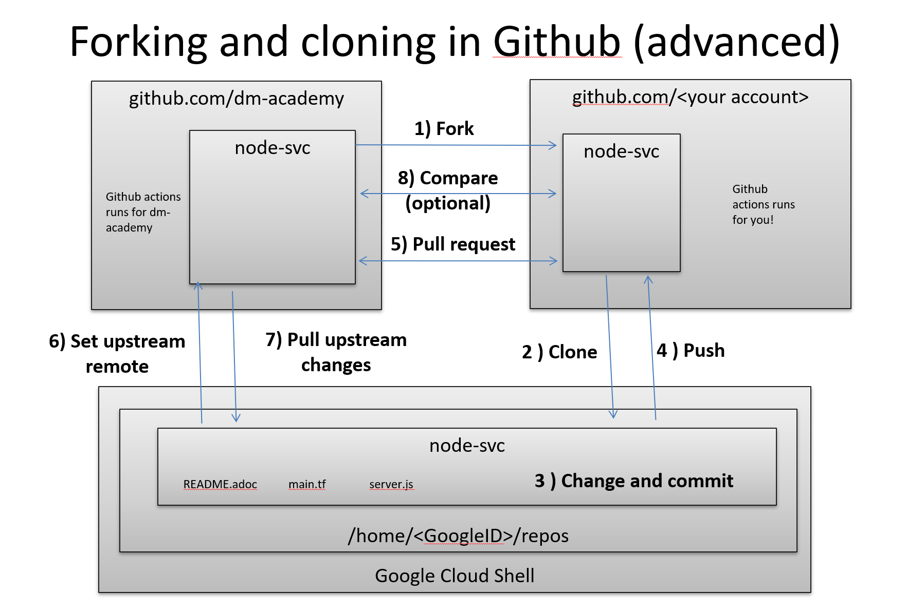

= Setting an upstream remote

=== Setting upstream remote for node-svc

Up until now, we have been somewhat haphazard and basic with our usage of git and Github, just as a startup with a couple of individuals might be -- primarily using it as a repository/archive, but not very effective as a collaboration tool. 

In particular, we have been using this basic approach: 

image:../week-00/images/github-arch.png[]

The problem with this approach is that there is no convenienjoe.fitzpatrick@transposit.comt way to pull updates from upstream into our local repo. 

There are two ways we can solve this. joe.fitzpatrick@transposit.com

1. I could make you all members of my Github project. This is too much administration for me every semester. 
2. We can continue to have you fork and then clone (as you would if you were participating in an open- source project for which you were not yet a committer) but set things up so that you can do it all from the command line. 

We will go with option #2. 

In order to proceed with #2, we need to better understand the concept of a git "remote." Git is a powerful tool for distributed collaboration on complex software projects, and therefore itself is complex. 

According to https://www.git-tower.com/, "A remote in Git is a common repository that all team members use to exchange their changes. In most cases, such a remote repository is stored on a code hosting service like GitHub or on an internal server."

What this does not mention is that a git repository can have _multiple_ remotes. Your local clone on the Google Cloud Shell has, as a remote, the fork you created in Github. This is its origin.  Now, you are going to set as your _upstream_ remote the original source repository you cloned from as a template. 

(This lab is based on these instructions: https://docs.github.com/en/free-pro-team@latest/github/collaborating-with-issues-and-pull-requests/configuring-a-remote-for-a-fork.)

So, let's configure remotes for both node-svc and dp-course. 

Go to your `repos` directory (or wherever you have put the repos). Enter (`cd`) into the node-svc repo, if you aren't there already from the last step. 

At the command prompt, enter: 

`git remote add upstream https://github.com/dm-academy/node-svc`

This adds the original repo as the `upstream` remote. You still have the `origin remote`, under _your_ GitHub account. 

I have done so using a test Github account called CharlesTBetz-test. I can see the result thus: 

[source,bash]
----
betz4871:node-svc$ git remote -v
origin  git@github.com:CharlesTBetz-test/node-svc.git (fetch)
origin  git@github.com:CharlesTBetz-test/node-svc.git (push)
upstream        https://github.com/dm-academy/node-svc (fetch)
upstream        https://github.com/dm-academy/node-svc (push)
betz4871:node-svc$
----

Notice there is both an `origin` and `upstream` remote. Examine the URLs for each. One points to the dm-academy master repo, the other points to its forked replica on my test account. 

Let's synch things up: 

`git pull upstream master`

Unless you have changed your local copy, or upstream has changed since you forked and cloned, this should indicate that everything is up to date. 

The overall architecture now looks like this (notice 6 and 7):

Now, go to your dp-course repo and do the same thing. 

From now on, before pushing any changes and especially before issuing a pull request, be sure to synch your local copy with upstream. 

IMPORTANT: It is convenient to sync your online git repo with upstream by just pushing the changes from your local repo (7 + 4). You also can compare across upstream and your fork and merge changes directly on Github (8 + 5). 

=== Further reading

* https://docs.github.com/en/free-pro-team@latest/github/collaborating-with-issues-and-pull-requests/configuring-a-remote-for-a-fork

* https://docs.github.com/en/free-pro-team@latest/github/collaborating-with-issues-and-pull-requests/syncing-a-fork

* https://docs.github.com/en/free-pro-team@latest/github/collaborating-with-issues-and-pull-requests/creating-a-pull-request-from-a-fork

* https://www.freecodecamp.org/news/how-to-delete-a-git-branch-both-locally-and-remotely/

* https://www.freecodecamp.org/news/git-pull-force-how-to-overwrite-local-changes-with-git/
