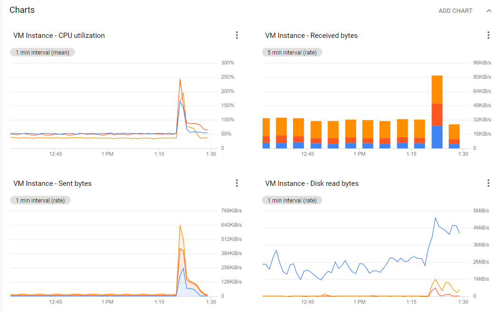
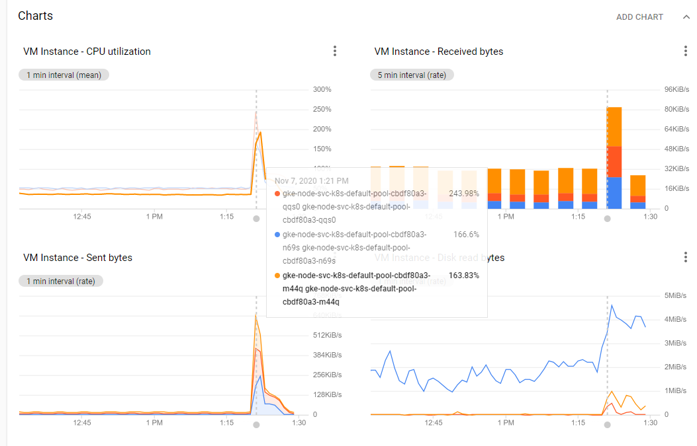
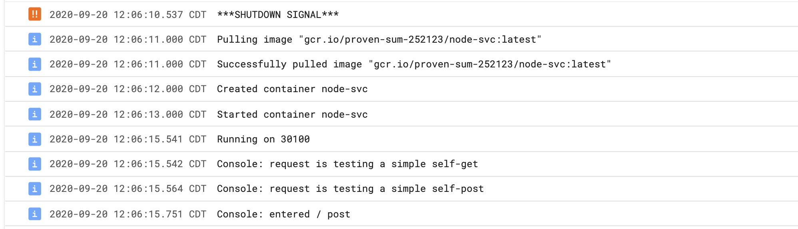
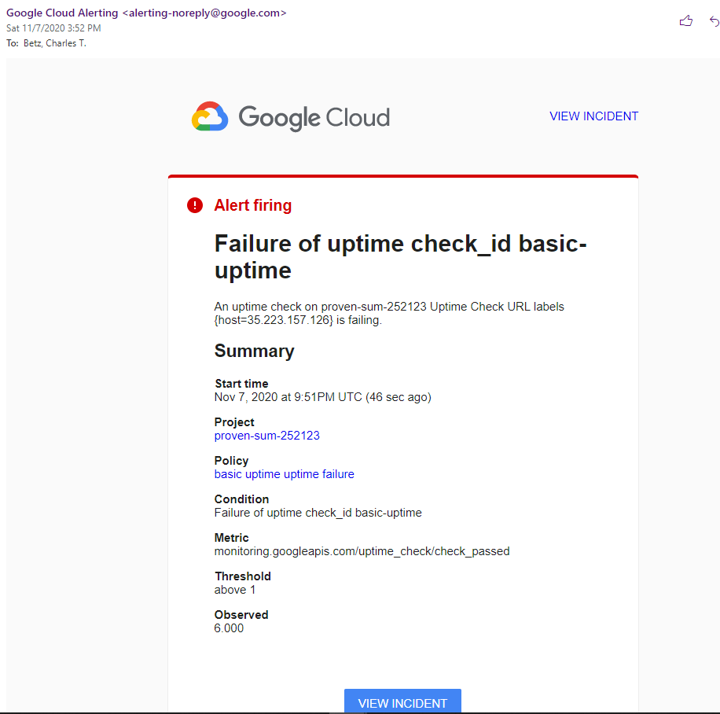
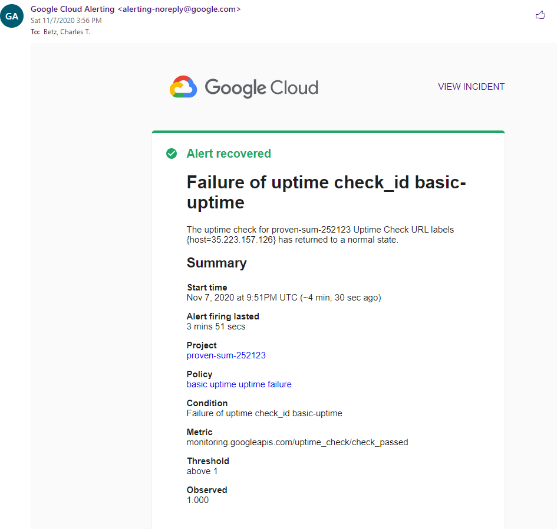

= Lab 06 Basic monitoring

==  Overview

Fall 2020: In Lab 06, we will continue to use the monitoring tools that helped us understand how to finish lab 03. 

Prerequisite: For this lab, go to your working node-svc directory and recreate your cluster (if necessary). 

=== Performance monitoring

Go to https://console.cloud.google.com/monitoring and view your current status. Your CPU utilization should be flat. 

Find your cluster IP addresses again: 

[source,bash]
----
gcloud --format="value(networkInterfaces[0].accessConfigs[0].natIP)" compute instances list --filter="tags.items=node-svc-k8s"
----

Copy one of the results and open `drive.sh`. Change the curl address to match your IP. 

[source,bash]
----
#!/bin/bash
while  [ 1 ]
do
  curl <your IP>:30100/50 
done
----

(What does it do? Review the code. You should never run a shell script without reviewing what it does.)

Run `drive.sh`. Your screen should fill up with output. You are stressing your Kubernetes cluster.

Go back to https://console.cloud.google.com/monitoring and wait a while. What do you see? Wait until you see a clear increase in cluster load. 

Go back to the Google Cloud Shell and hit ctrl-c. Go back to monitoring and wait until the load diminishes. 

IMPORTANT: Do not run the load script for more than 5 minutes. I am not yet clear on the billing implications of doing this. Extra credit for anyone who can track down if this script results in charges against your credit. 

Take a screen shot of the spike and paste into a working assignment doc. It should look like this: 

Notice that you can hover over various parts of the graph. Go to your console and type `kubectl get nodes` and compare the values to the labels for the lines (on the images here the blue, lighter orange, and darker orange). You will see that each line represents the metrics from a given node. 

A vertical dotted line indicates the time you are examining, and metric values appear. Here, we see that on my cluster CPU utilization spiked at 243.98%. (How is it over 100%?)

Using the metrics explorer, in your Word document take four different screen shots showing: 

* The highest "CPU utilization"
* The highest "Sent bytes"
* The highest "Received bytes"
* The highest "Disk"

You *must* show the actual value by correctly hovering over the right location on the graph and producing a translucent window, as shown above.

=== Kubernetes self-healing

One of the features of the https://github.com/dm-academy/node-svc[node-svc] app is a shutdown URL. If you call: 

`curl <node-url>:30100/999` 

whichever container receives it will SHUT DOWN. Kubernetes will then react. 

What did it do? For this, we need to look not at monitoring, but logs. Go to  https://console.cloud.google.com/logs/. You may need to hit the "Jump to Now" button. You should see: 

Take a screen shot showing the time and paste it into your assignment document. 

But what happened? The cluster was running five replicas of the service. One was shut down. The cluster detected this as a policy violation. It pulled a new image from the repository and restarted it, which is why after SHUTDOWN SIGNAL you see the usual startup messages generated by node-svc. 

How does the message "Shutdown Signal" appear in the log? It's in server.js. Paste a screen shot of the code that generates it, including the URL path that starts the shutdown process.

=== Kubernetes uptime

A simple way to have confidence in a service is to create an uptime check. A simple one periodically accesses a URL and validates that it's responding as expected. 

Google makes it easy to create such checks. Go to  https://console.cloud.google.com/monitoring, "Uptime checks|CREATE CHECK."

*Assignment*. We are not going to give you detailed instructions, as this should be straightforward. Give the check a title, put one of the node IP addresses in, set the port (you have to open up the further options), ensure that the response content contains the word GET, and set the notification so that you get emailed if it's down. You have to configure an email as a notification channel, and refresh the list to choose it. 

Once you have this configured, break you service by going `kubectl delete svc node-svc-public` from the Google Cloud Shell. 

You should within 5 minutes get an email that looks like this: 

Take a screenshot of the email and paste it into your assignment. You can navigate to the incident by going to "View Incident" button on the bottom. Do so, and inspect the various elements and bits of information. What do you think "acknowledge incident" does? Click on it. What do you think "silence incident" does?

To bring the service back up, run `kubectl apply -f services.yaml`, which will reinstate the public IP service on the cluster and cause the uptime check to recover.

Within 5 minutes you should get an email that looks like this: 

Take a screenshot of the email and paste it into your assignment. 

== Conclusion

Submit your Word docment via Canvas. 

 

