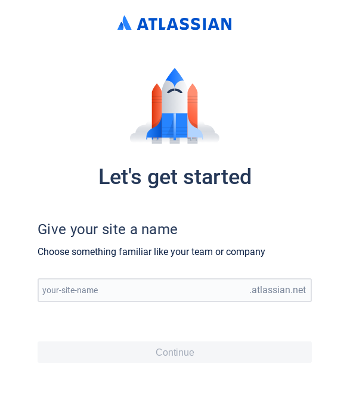
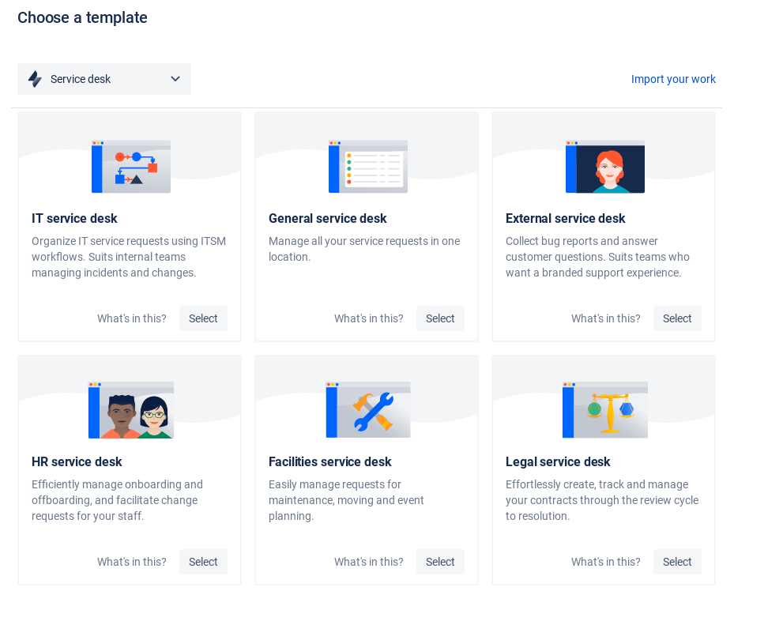
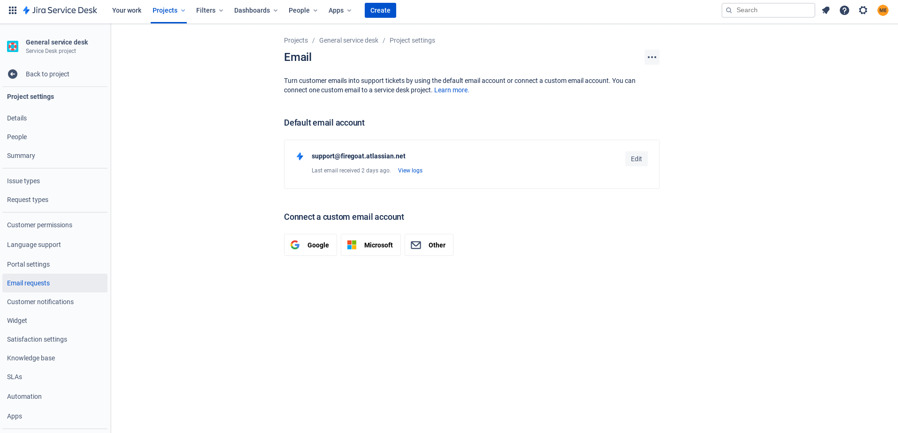

= Lab 07 Team-based Alerting

== Overview

Fall 2020: In Lab 06 we explored basic monitoring and metrics. As part of monitoring, we created an uptime check that queried our service and sent us an email if the service did not respond. In a real-world monitoring and alerting situation, we don't want just one person to be on the hook for receiving alerts. So in Lab 07 we'll explore sending our alerts to a centralized system.

Prerequisite: Fire up your node-svc cluster if necessary. Once this is complete, ensure that your uptime check from Lab 06 is checking your cluster and that the check is reporting success.

== Team-based Alerting

If the service we're running is critical to our business, we want to make sure that a failure of that service never goes unnoticed. A common pattern to accomplish this is to have an on-call rotation. Services like PagerDuty or VictorOps let us set up schedules that route alerts to an on-call member of the team who can then diagnose the problem and get working on a fix or call in additional help.

A variation on this pattern is to route monitoring alerts to a service desk application. This application might be responsible for accepting and routing customer technical complaints, tickets from internal staff who need assistance, and automated monitoring alerts. The goal is still the same - to ensure that a major service disruption is always noticed and dealt with.

In Lab 07 we'll be trying out the service desk pattern with a free trial of Jira Service Desk.

* Go to https://www.atlassian.com/software/jira/service-desk
* Click the "Get it free" button.
* You'll be presented with two choices - select "Jira Service Desk" (the one WITHOUT the knowledge base)
* You can now sign up for an account. It is probably easiest to "Continue with Google" using the same google account you used to sign up for Google Cloud Provider.
* As part of sign up, you'll be prompted to "Claim your site". Pick a unique identifier here - something you can remember.

The system will prompt you to create your first project based off a template. The selection isn't too important here, but `IT service desk` or `General service desk` are appropriate choices.

You'll finally arrive at a screen that shows you an overview of your new service desk project.

image:images/home.png[]

Start by creating a new ticket. Take some time to look through all the fields in this screen. A ticket is a place to collect information about a given problem so that it can be handed off between team members with as little friction as possible. Thus, most communication about a given problem should be filed in its ticket, whether that communication is internal (between IT team members) or external (out to a customer who raised the ticket because they were having a problem).

Once you've created the ticket, it should appear in the `queues` area of your project. Note that it is unassigned (you could assign it to yourself).

We've just created a ticket through our internal system. What happens if we want to let our customers send us tickets? One option is to provide them a web portal that prompts them for various information about their problem. Another is to provide an email address. But we don't just want a shared email box, we want emails about problems to wind up in the tool where we track and communicate about problems in a defined manner. Most service desk software, including Jira, allows for this.

* Go to the `project settings` menu. It's accessible from the left side of your service desk home page.
* From the `project settings` menus click `Email requests`.
* Take note of the default email account listed on this page. This is the email address for ingesting new tickets.

* Send an email to this address from your personal email account. In addition to seeing a ticket created in your service desk system, you should also get an automated response from the service desk system back to your own email account letting you know that your request was received. Good service desk software allows us to automate processes like letting a customer know we've received their request.