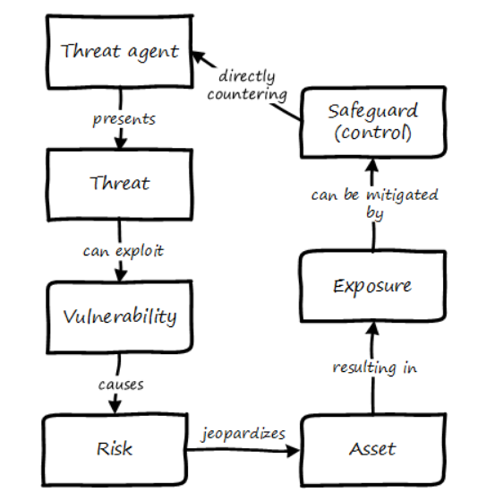
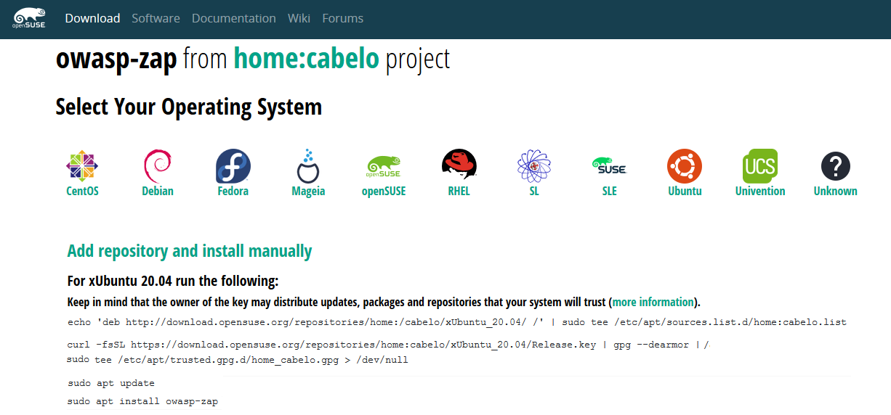

= Lab 10: Security, and Governance, Risk, and Compliance

== Objectives

In this lab, you will gain some hands on experience in vulnerability scanning and remediation.

Objectives:

* Understand a "vulnerability" and how it can be detected
* Understand how a vulnerability may be fixed or remediated

== Overview

Working individually, you will run an "inside-out" vulnerability scan and a simple "outside-in" penetration scan on a virtual machine.  

The testing will be performed by downloading a vulnerability scanner and running it on your server.

You will research the results and recommend at least one fix that can be implemented.

You will fix at least two vulnerabilities and participate in group and class discussion about how this relates to the broader topics of governance, risk, and compliance.

=== Getting started

Start up a Virtual Machine, login to your personal server and perform an update.

$ sudo apt-get update 

Install Lynis. The overall instructions are here:  

https://cisofy.com/documentation/lynis/get-started

Download lynis using the 'Installation via Git' approach.  
NOTE: Use sudo to perform the clone operaton.

Run lynis audit system.

NOTE: Lynis will generate hundreds of findings that will scroll off your display.  Redirect the lynis output to a file, e.g. lynis_out, so you can view it later.
Since you are redirecting the output to a file, you may have to cd to a directory where you have write permission. Then use the syntax `sudo <directory where the lynis executable got downloaded>/lynis audit system > lynis_out"

The lynis scan is run internally on the server, as a script or application that reviews the server's configuration in painstaking detail.   
It will generate hundreds of findings.  You should pick one or two and research them and figure out if there is an easy fix.

This scan is run internally on the server, as a script or application that reviews the 
server's configuration in painstaking detail. Lots of output that looks like:

....
- Checking for old files in /tmp                            [ OK ]
 - Checking /tmp sticky bit                                 [ OK ]
 - Mount options of /                                       [ OK ]
 - Checking Locate database                                 [ FOUND ]
.
.
.

 * Consider hardening SSH configuration [SSH-7408]
    - Details  : AllowAgentForwarding (YES --> NO)
      https://cisofy.com/controls/SSH-7408/

  * Configure minimum password age in /etc/login.defs [AUTH-9286]
      https://cisofy.com/controls/AUTH-9286/

  * Configure maximum password age in /etc/login.defs [AUTH-9286]
      https://cisofy.com/controls/AUTH-9286/
....

Let's fix the minium and maxium password age issue in login.defs.

Open file /etc/login.defs using text editor:
# sudo nano /etc/login.defs

Setup (sample) values as follows:

 PASS_MAX_DAYS 30
 PASS_MIN_DAYS 1
 PASS_WARN_AGE 7

To restart sshd on ubuntu 16, use the command:

 sudo systemctl restart sshd

For earlier versions of Ubuntu, use:

 sudo service ssh restart

Between these two resources you should be able to fix the issue. If you have questions, post them to Slack. When you have fixed the issue, run the scan again and confirm the banner is no longer an issue.

=== System hardening

Now for the hard part. Find another vulnerability you can fix. To use class time most efficiently, you should post the vulnerabilities you are researching to Slack. Don't start on something someone else is doing.

You should take some time and think about and/or research the risk any given vulnerability presents. Remember the CISSP terminology:

We will pause class and discuss interesting cases.

TIP: If you search Google on the Lynis ID, e.g. `AUTH-9286`, you should be taken to the cisofy.com site (or perhaps other resources) which will get you started on resolving it.

NOTE: Do not try to fix the banners issue. It only can be tested by logging directly into the server console (which in the case of a VM doesn't really exist), not via ssh.

Be prepared to share you results, positive or negative. If you fix a vulnerability, be sure to document the steps so they could be scripted.

After you have fixed one more lynis vulnerability, read http://www.sonatype.org/nexus/2015/11/13/did-you-wake-up-to-an-alert-about-the-java-deserialization-vulnerability and discuss with your neighbors. What is the National Vulnerability Database? Be prepared to discuss in class.

== Permanently fixing one or more vulnerabilities (10+ extra credit points).

First, you need to figure out the configuration change required to fix the vulnerability. It should be something that you can script.

* something installed that doesn't need to be
* something that should be there, that isn't
* permissions that need to be tightened down.

* 1 vulnerability fixed: 10 points
* 2 : 15 points
* 3 : 20 points.
* 10 or more: 30 points

In order to gain the extra credit:

* Create a new VM and run the vulnerability scanner.
* Save the output to a text file, named "initial-output.log"
* Run the necessary commands to fix the vulnerability.
* Put them into a shell script.
* Run the scanner again, saving the output to "final-output.log" and showing that they are fixed

IMPORTANT: Submit the 2 output files, and your script for extra credit.

You can script commands like

 apt-get install <some program>

You can't script an interactive text editor (like nano). To change configuration files, sed is your friend. Simple example:

....
char@seis664:~$ echo myScriptContent > test.txt
char@seis664:~$ cat test.txt
myScriptContent
char@seis664:~$ sed -i s/Script/New/g test.txt
char@seis664:~$ cat test.txt
myNewContent
....

You may need to Google "regular expressions."

=== Web vulnerability testing scan
(if time)

When you have reflected enough on the Java deserialization vulnerability and the implications of that article, move on to a Web vulnerability. We will install Java and apache2 on your VM. (Don't try to install these on the main server; you won't be able to.)

First review the first few pages of the https://github.com/zaproxy/zaproxy/releases/download/2.5.0/ZAPGettingStartedGuide-2.5.pdf[zaproxy docs].

ON YOUR VM, perform an update and install java and apache2:

....
sudo apt-get update
sudo apt-get install -y default-jdk apache2
....

Install owasp-zap.  
Go to https://www.zaproxy.org/download/ and scroll down until you find the link 'ZAP Linux Repos'.  Click on this link to go to the download page.
On the download page, select your operating system, then click on 'Add repository and install manually'.  Execute the commands that get displayed for 
the operating system that you chose.

For example, if you chose the Ubuntu operation system:

....

./zap.sh -cmd -quickurl http://localhost:80

We run this script externally to the machine being tested, and give it the URL. It then probes the URL and the server, as a form of penetration testing. It will again generate a number of findings. Research them and figure out if there is an easy fix. Share with class on Slack.

NOTE: You will get raw XML dumped to the terminal. You can cut and paste this to an *.xml document on your workstation and open it with a browser for an easier view.

=== Optional ITSM process
Time and instructor lab preparation permitting:

* The vulnerability should be registered as a Problem in iTOP, against the server it is detected on.

* The server rebuild that fixes it will be executed as a Change.

* The Change and the Problem should reference the git pull request ID.

* The Change will then be confirmed as having fixed the Problem, which will then be closed out.

== Tools
The following tools were evaluated as part of developing this lab.

=== Lynis

https://cisofy.com/lynis/
http://linux-audit.com/how-to-deal-with-lynis-suggestions/
http://linux-audit.com/linux-vulnerabilities-explained-from-detection-to-treatment/

=== OpenSCAP
http://www.open-scap.org/

=== ZAP
https://github.com/zaproxy/zaproxy
https://github.com/zaproxy/zaproxy/releases/download/2.4.0/ZAPGettingStartedGuide-2.4.pdf

=== NIST database
https://nvd.nist.gov/

=== Listings
http://resources.infosecinstitute.com/14-popular-web-application-vulnerability-scanners/

http://www.networkworld.com/article/2176429/security/security-6-free-network-vulnerability-scanners.html

=== Useful stuff
http://hardenubuntu.com/initial-setup/
http://www.sonatype.org/nexus/2015/11/13/did-you-wake-up-to-an-alert-about-the-java-deserialization-vulnerability

http://continuousdelivery.com/2013/08/risk-management-theatre/

Nessus is often used by security professionals; it is commercial.

OpenVAS is another option, not evaluated.
