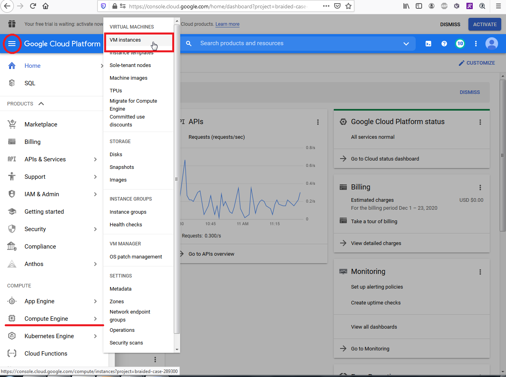
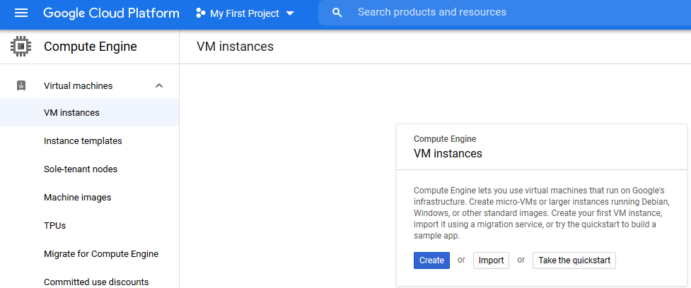
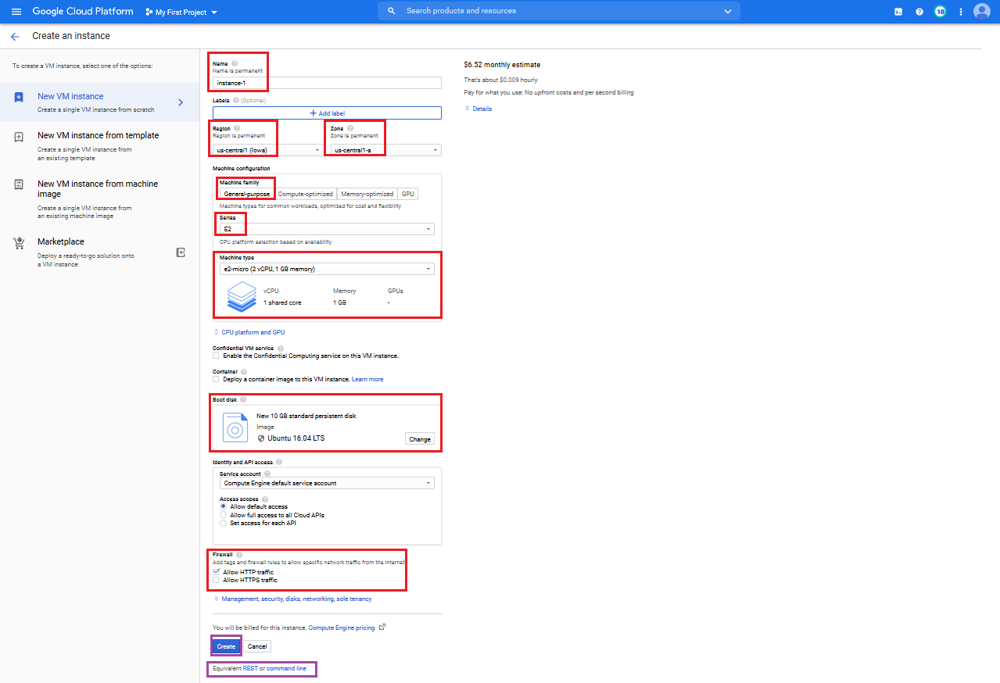

= Pre Lab 10: Create a VM instance using the Google Cloud Console

== Objectives

In this lab, you will create a VM instance and then shell into the VM instance using the Google Cloud Console.

Objectives:

* Understand how to create a VM instance using the Google Cloud Console.
* Understand how to communicate with the VM instance.

== Overview

This lab is for those of you that aren't familiar with how to create a VM instance using the Google Cloud Console. Up to this point, we have created a VM instance, created a ssh public key and then shelled into VM instance using the Google Cloud Platform command line.  Just like any other software package, there are alternative ways to do this.  This lab will show you an alternate method of creating a VM instance and then shelling into from the Google Cloud Console.

Also, in prior labs we have created a VM instance and checked to see if we could connect to the instance by issuing the curl command.  We confirmed connection to the instance if the command line prompt came back after issuing the curl command.  This really isn't that exciting and doesn't show you what you can do with the VM instance.  In this lab, we will display an html page in the VM instance from your browser.  It reflects what you would expect to see when you visit a website.

=== Lab 01 Review

In Lab 01, we created a VM instance using the following commands in the Google Cloud Shell.

[source,bash]
----
$ gcloud config set compute/region us-central1  # Set a default compute region
$ gcloud config set compute/zone us-central1-c  # Set a default compute zone

# Use the following gcloud command in your terminal to launch a VM instance, named node-svc-01, with Ubuntu 16.04 distro:
$ gcloud compute instances create  node-svc-01\
    --image-family ubuntu-minimal-2004-lts  \
    --image-project ubuntu-os-cloud \
    --boot-disk-size 10GB \
    --machine-type f1-micro

$ ssh-keygen -t rsa -f ~/.ssh/node-user -C node-user -P ""  # Generate an SSH key pair for future connections to the VM instance

# Add your public key to your project:
$ gcloud compute project-info add-metadata \
    --metadata ssh-keys="node-user:$(cat ~/.ssh/node-user.pub)"

$ echo $SSH_AGENT_PID  # Check your ssh-agent is running
$ ssh-add ~/.ssh/node-user  # Add the SSH private key to the ssh-agent
$ ssh-add -l  # Verify that the key was added to the ssh-agent:

# Configure the environment and connect to the started VM via SSH 
$ export NODE_IP_01=$(gcloud --format="value(networkInterfaces[0].accessConfigs[0].natIP)" compute instances describe node-svc-01)
$ ssh node-user@${NODE_IP_01}
----

=== Getting started with the Google Cloud Console

We can create a VM instance using the Google Cloud Console.  You can use the syntax of the command line call as a guide to set up the VM instance on the Google Cloud Console. 

[source,bash]
----
"gcloud compute instances create  node-svc-01"

"gcloud" -> Start up your Google Cloud Console and go to the hamburger symbol on the upper left.
"compute" -> Scroll down to Compute Engine
"instances" -> Mouse over, up and click on VM Instances
----

On the VM Instances page,

[source,bash]
----
"create" -> Click Create
----

You will then be taken to the Create Instance page where you can set up the VM environment.  Here, you can enter the instance name, set the region and zone, configure the machine and machine type, select a boot disk and set up firewall rules.

Go ahead and start up the Google Cloud Console and create a VM instance using the following values:

[source,bash]
----
    Instance name  = <enter your instance name>    
    Leave the default region at us-central-1 (Iowa) and us-central1-a
    Leave the machine family at General-purpose
    Leave the Series at E2
    Set the machine-type to e2-micro.  Note the monthly estimated cost in the upper right.  Switch to a different machine-type and note the new estimated cost
    Set the boot-disk to Ubuntu.  Once again note the monthly estimated cost.
    Under Firewall, allow HTTP traffic.
    
    Before you click Create, if you would like to see the equivalent command line syntax, click on 
    
    
    
    
    
    
    
----

